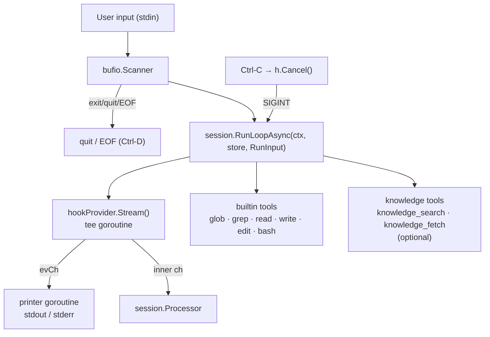
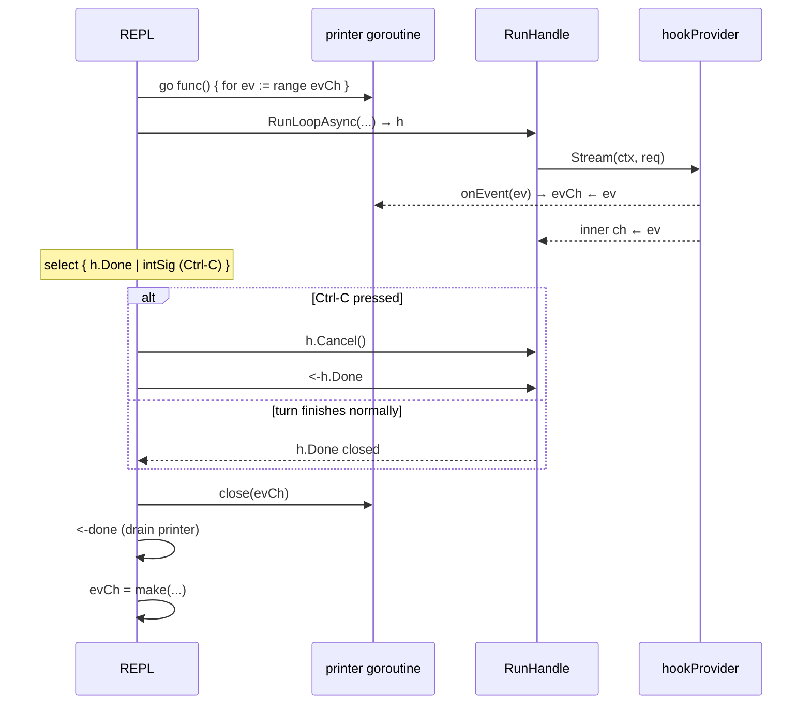

# cmd/control

`cmd/control` is an interactive terminal REPL **and web UI** that runs a persistent LLM
session in the current directory. It registers the six builtin file tools and optionally
a knowledge index of skill documentation, then enters either a terminal read-evaluate-print
loop or starts an HTTP server (when `-web` is set), both backed by `session.RunLoopAsync`.

Files:
- `cmd/control/main.go` — CLI flags, REPL loop, `hookProvider`, tool setup
- `cmd/control/web.go` — HTTP server, `/chat` SSE endpoint, `/context` endpoint
- `cmd/control/ui.go` — Embedded single-page web UI (`uiHTML` constant)

---

## Architecture



### hookProvider — event tee

`RunLoopAsync` drives the LLM via `session.Processor`, which consumes events
from `Provider.Stream()`. To print streaming output concurrently, `hookProvider`
wraps the real provider and calls `onEvent` for every event before forwarding it.

```go
type hookProvider struct {
    inner   llm.Provider
    onEvent func(llm.Event)
}
```

The REPL builds `hookProvider` once at startup; `onEvent` sends into `evCh`:

```go
evCh := make(chan llm.Event, 128)
prov := &hookProvider{
    inner:   innerProv,
    onEvent: func(ev llm.Event) { evCh <- ev },
}
```

`evCh` is reset to a new channel after each turn (`evCh = make(...)`). Because
the closure captures the `evCh` **variable** (not its value), each new channel
is automatically used by the existing `hookProvider` without any re-assignment
of `prov`.

### Per-turn lifecycle (REPL mode)



### User cancellation (Ctrl-C)

SIGINT is handled **per-turn**, not process-wide:

- `signal.NotifyContext` listens for `SIGTERM` only (process exit).
- A separate `intSig := make(chan os.Signal, 1)` with `signal.Notify(intSig, syscall.SIGINT)`
  is used inside the REPL loop.
- On Ctrl-C: `h.Cancel()` is called, `[cancelled]` is printed, the REPL returns
  to the `> ` prompt. The process keeps running.
- `context.Canceled` errors from a cancelled turn are silenced (not printed as errors).

### Skills index

On startup, `buildSkillsIndex(skillsDir)` recursively walks all `*.md` files
under the skills directory and builds an **in-memory Bleve index** with four
fields:

| Field | Type | Content |
|-------|------|---------|
| `title` | text | `name:` from YAML frontmatter, or filename stem |
| `content` | text | document body (after frontmatter) |
| `skill` | keyword | first path segment relative to skillsDir |
| `path` | keyword | absolute file path |

If the skills directory does not exist, a warning is printed and the
knowledge tools are simply not registered — the REPL still works without them.

---

## CLI Flags

| Flag | Env | Default | Description |
|------|-----|---------|-------------|
| `-provider` | `TIMI_PROVIDER` | `openai` | LLM provider: `openai` or `anthropic` |
| `-llm-url` | `TIMI_BASE_URL` | see `cmd/control/main.go` | Base URL (openai needs `/v1`; anthropic must NOT end with `/v1`) |
| `-llm-key` | `TIMI_API_KEY` | see `cmd/control/main.go` | API key |
| `-model` | `TIMI_MODEL` | `claude-sonnet-4.6` | Model ID |
| `-max-steps` | — | `20` | Max agentic steps per turn |
| `-context-limit` | — | `128000` | Context window token limit |
| `-skills` | — | `.opencode` | Skills root directory to index |
| `-web` | — | `false` | Start web UI instead of terminal REPL |
| `-debug` | — | `false` | Record all Stream() calls to `debug-<ts>.ndjson` (ndjson, one line per call) |

Priority: CLI flag > env var > hardcoded default (only in `flag.StringVar`).

### Anthropic base URL

`anthropic-sdk-go` auto-appends `/v1/messages`. When `-provider anthropic` is
used, control strips a trailing `/v1` from the resolved URL before passing it
to the provider:

```go
baseURL := strings.TrimSuffix(cfg.baseURL, "/v1")
```

So `-llm-url http://host/claude/v1` and `-llm-url http://host/claude` both work.

---

## `-debug` recording

When `-debug` is set, `innerProv` is wrapped in a `llm.RecordProvider` **before**
`hookProvider`. This transparently records every `Stream()` call (request +
filtered events including real token usage) to `debug-<ts>.ndjson`.

```
innerProv  →  RecordProvider  →  hookProvider  →  session.RunLoopAsync
```

One ndjson file captures all turns for the entire session. The file can be
replayed with `cmd/replay` to reproduce compaction behaviour offline.

```go
if cfg.debug {
    path := fmt.Sprintf("debug-%d.ndjson", time.Now().UnixMilli())
    rec, _ := llm.NewRecordProvider(innerProv, path)
    defer rec.Close()
    innerProv = rec
}
```

---

## Registered Tools

### Builtin file tools (always registered)

| Tool name | Struct | Description |
|-----------|--------|-------------|
| `glob` | `builtin.GlobTool` | Pattern file search |
| `grep` | `builtin.GrepTool` | Regex content search |
| `read` | `builtin.ReadTool` | Read file or directory |
| `write` | `builtin.WriteTool` | Write file |
| `edit` | `builtin.EditTool` | Exact string replace in file |
| `bash` | `builtin.ShellTool` | Execute shell commands |

All tools are initialized with `WorkDir: cwd` and **reused for the entire
session** (important for `EditTool` which holds a per-file mutex map).

### Knowledge tools (registered when skills dir exists)

| Tool name | Description |
|-----------|-------------|
| `knowledge_search` | Full-text search returning snippets + RefIDs |
| `knowledge_fetch` | Fetch full content of a document by RefID |

Source ID: `"skills"` → RefIDs have the form `skills:subdir/SKILL.md`.

---

## Web Server Mode (`-web`)

When `-web` is set, control starts an HTTP server on a random local port instead of
the terminal REPL. The port is printed on startup.

### Endpoints

| Endpoint | Method | Description |
|----------|--------|-------------|
| `/` | GET | Embedded single-page UI (`ui.go`) |
| `/chat` | POST | SSE endpoint — accepts `{"message":"..."}`, streams events |
| `/cancel` | POST | Cancel the in-flight turn; returns 204 |
| `/context` | GET | Returns current session context window as JSON |

### `/chat` implementation

`handleChat` in `web.go` uses `RunLoopAsync` + cancel-prev-turn, identical to
`cmd/llm-api`:

1. Build a per-request `hookProvider{inner: app.prov, onEvent: SSE forwarder}`
2. Cancel any in-flight handle for this session (`prev.Cancel(); <-prev.Done`)
3. Call `session.RunLoopAsync(ctx, store, RunInput{Provider: hookProv, ...})`
4. Register handle; wait `<-h.Done`; send `cancelled` or `done` SSE event

`appState.prov` is `llm.Provider` (plain interface, not `*hookProvider`). The
SSE-forwarding hook is created fresh per request inside `handleChat`.

### `/chat` SSE event types

| `type` | Fields | Description |
|--------|--------|-------------|
| `text` | `delta` | Streaming text delta from LLM |
| `tool_call` | `tool`, `input` | Tool invoked (display path) |
| `usage` | `input`, `output`, `total` | Token counts after each step |
| `error` | `error` | Error message (not sent for `context.Canceled`) |
| `cancelled` | — | Turn was cancelled by user |
| `done` | — | Turn complete (always sent last) |

### Cancellation (web mode)

| Trigger | Mechanism |
|---------|-----------|
| ESC key | `document.addEventListener('keydown')` — fires `cancelTurn()` → POST `/cancel` |
| New message while turn active | `handleChat` cancels the previous in-flight handle before starting a new one |

Send button is **always enabled** — sending a new message while a turn is active
automatically cancels the previous turn (backend side, via `prev.Cancel(); <-prev.Done`).
ESC provides a pure-cancel path when the user wants to stop without sending anything new.

`/cancel` calls `activeHandle.Cancel()` and returns `204`. The running
`handleChat` goroutine receives `context.Canceled` from `<-h.Done`, sends
a `cancelled` SSE event, then sends `done`. The UI shows `⊘ cancelled` below
the partial response.

### `/context` response

```json
{
  "session_id": "...",
  "messages": 12,
  "total_chars": 45000,
  "context": [
    {
      "role": "user",
      "total_chars": 120,
      "content": [
        { "type": "text", "chars": 120, "preview": "first 2000 chars..." }
      ]
    }
  ]
}
```

Each content part's `preview` is capped at 2000 chars. The web UI renders parts
as collapsible rows (▶/▼) with internal scrolling (max-height 300px).

---

## Session Persistence

A single `store/memory.Store` and a single `sessionID` are used for the entire
REPL lifetime. Every user turn appends to the same session, so the LLM has full
conversation history across turns (subject to context compaction).

```go
sessionID = "control-<unix-nano>"
```

---

## System Prompt

`DisableProviderPrompt` is **not set** (defaults to false), so the embedded
per-provider prompt is always included. `ExtraSystem` appends:

```
You are an interactive coding assistant running in directory: <cwd>
Tool usage priority:
1. Always call knowledge_search first to look up relevant documentation, architecture, and design guides.
2. If the search results are insufficient or no relevant knowledge is found, then use file tools (glob, grep, read, write, edit, bash) to explore the codebase directly.
Never skip the knowledge lookup step when answering questions about the codebase.
Always work within <cwd> unless explicitly instructed otherwise.
```

---

## Running

```bash
# with defaults (openai, local endpoint)
go run ./cmd/control

# explicit flags — values read from TIMI_* env vars if not specified
go run ./cmd/control \
    -provider anthropic \
    -llm-url  $TIMI_BASE_URL \
    -llm-key  $TIMI_API_KEY \
    -model    claude-sonnet-4.6 \
    -skills   .opencode

# with debug recording
go run ./cmd/control -debug

# via env vars
TIMI_PROVIDER=openai TIMI_API_KEY=sk-... go run ./cmd/control
```

Build:

```bash
go build ./cmd/control/...
```

---

## Key Files

| File | Purpose |
|------|---------|
| `cmd/control/main.go` | CLI flags, REPL loop, `hookProvider`, Ctrl-C cancellation, tool/knowledge setup |
| `cmd/control/web.go` | HTTP server, `/chat` SSE (RunLoopAsync + cancel-prev-turn), `/context` |
| `cmd/control/ui.go` | Embedded single-page web UI (`uiHTML` const) |
| `tool/builtin/` | Six builtin file tools |
| `knowledge/source/bleve/bleve.go` | BleveSource used for skills index |
| `store/memory/memory.go` | In-memory session store |
| `session/prompt.go` | `RunLoop`, `RunLoopAsync`, `RunHandle`, `RunInput` |
| `llm/record_provider.go` | `RecordProvider` — transparent recording wrapper (`-debug`) |
| `llm/replay_provider.go` | `ReplayProvider` — used by `cmd/replay` to replay recordings |
