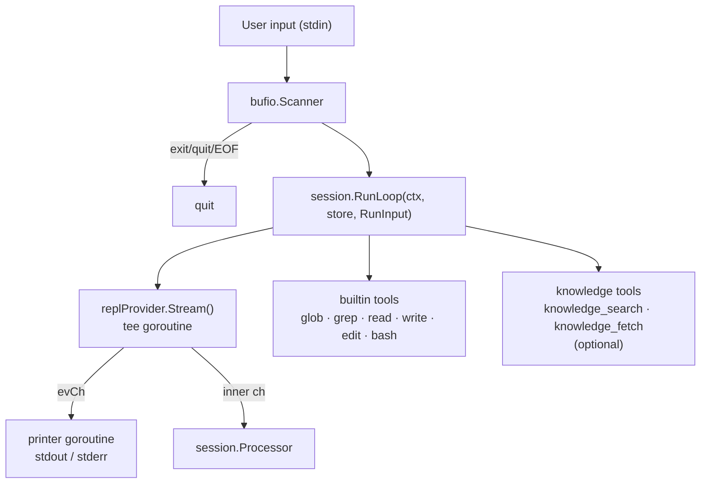

# cmd/control

`cmd/control` is an interactive terminal REPL **and web UI** that runs a persistent LLM
session in the current directory. It registers the six builtin file tools and optionally
a knowledge index of skill documentation, then enters either a terminal read-evaluate-print
loop or starts an HTTP server (when `-web` is set), both backed by `session.RunLoop`.

Files:
- `cmd/control/main.go` — CLI flags, REPL loop, `replProvider`, tool setup
- `cmd/control/web.go` — HTTP server, `/chat` SSE endpoint, `/context` endpoint
- `cmd/control/ui.go` — Embedded single-page web UI (`uiHTML` constant)

---

## Architecture



### replProvider — event tee

`RunLoop` is **synchronous** and drives the LLM via `session.Processor`, which
consumes events from `Provider.Stream()`. To print streaming output while
`RunLoop` is blocking, `replProvider` wraps the real provider and tees every
event to a local `chan llm.Event` (`evCh`).

`replProvider` also supports an optional `onRequest func(req llm.Request)` callback,
called once per `Stream()` invocation **before** forwarding to the inner provider.
This is used by the web server's `-debug` mode to capture the full LLM input
(`llm.Request`, including messages, system prompt and tools) for each agentic step.

```go
type replProvider struct {
    inner     llm.Provider
    out       chan llm.Event
    onRequest func(req llm.Request) // optional; nil in REPL mode
}
```

Per-turn lifecycle (REPL mode):

```mermaid
sequenceDiagram
    participant REPL
    participant printer as printer goroutine
    participant RunLoop as session.RunLoop
    participant replProv as replProvider

    REPL->>printer: go func() { for ev := range evCh }
    REPL->>RunLoop: RunLoop(...) [blocks]
    RunLoop->>replProv: Stream(ctx, req)
    replProv-->>printer: evCh ← ev (tee)
    replProv-->>RunLoop: inner ch ← ev (pass-through)
    RunLoop-->>REPL: return (RunResult, error)
    REPL->>printer: close(evCh)
    REPL->>REPL: <-done (drain)
    REPL->>REPL: evCh = make(...); prov.out = evCh
```

### Skills index

On startup, `buildSkillsIndex(skillsDir)` recursively walks all `*.md` files
under the skills directory and builds an **in-memory Bleve index** with four
fields:

| Field | Type | Content |
|-------|------|---------|
| `title` | text | `name:` from YAML frontmatter, or filename stem |
| `content` | text | document body (after frontmatter) |
| `skill` | keyword | first path segment relative to skillsDir |
| `path` | keyword | absolute file path |

If the skills directory does not exist, a warning is printed and the
knowledge tools are simply not registered — the REPL still works without them.

---

## CLI Flags

| Flag | Env | Default | Description |
|------|-----|---------|-------------|
| `-provider` | `TIMI_PROVIDER` | `openai` | LLM provider: `openai` or `anthropic` |
| `-llm-url` | `TIMI_BASE_URL` | see `cmd/control/main.go` | Base URL (openai needs `/v1`; anthropic must NOT end with `/v1`) |
| `-llm-key` | `TIMI_API_KEY` | see `cmd/control/main.go` | API key |
| `-model` | `TIMI_MODEL` | `claude-sonnet-4.6` | Model ID |

Resolution order: CLI flag → env var → hardcoded default in `main.go` → ask the user.
| `-max-steps` | — | `20` | Max agentic steps per turn |
| `-context-limit` | — | `128000` | Context window token limit |
| `-skills` | — | `.opencode` | Skills root directory to index |
| `-web` | — | `false` | Start web UI instead of terminal REPL |
| `-debug` | — | `false` | (web mode only) Record each turn's LLM requests to `<session-id>/chat-<ts>.json` |

Priority: CLI flag > env var > hardcoded default (only in `flag.StringVar`).

### Anthropic base URL

`anthropic-sdk-go` auto-appends `/v1/messages`. When `-provider anthropic` is
used, control strips a trailing `/v1` from the resolved URL before passing it
to the provider:

```go
baseURL := strings.TrimSuffix(cfg.baseURL, "/v1")
```

So `-llm-url http://host/claude/v1` and `-llm-url http://host/claude` both work.

---

## Registered Tools

### Builtin file tools (always registered)

| Tool name | Struct | Description |
|-----------|--------|-------------|
| `glob` | `builtin.GlobTool` | Pattern file search |
| `grep` | `builtin.GrepTool` | Regex content search |
| `read` | `builtin.ReadTool` | Read file or directory |
| `write` | `builtin.WriteTool` | Write file |
| `edit` | `builtin.EditTool` | Exact string replace in file |
| `bash` | `builtin.ShellTool` | Execute shell commands |

All tools are initialized with `WorkDir: cwd` and **reused for the entire
session** (important for `EditTool` which holds a per-file mutex map).

### Knowledge tools (registered when skills dir exists)

| Tool name | Description |
|-----------|-------------|
| `knowledge_search` | Full-text search returning snippets + RefIDs |
| `knowledge_fetch` | Fetch full content of a document by RefID |

Source ID: `"skills"` → RefIDs have the form `skills:subdir/SKILL.md`.

---

## Web Server Mode (`-web`)

When `-web` is set, control starts an HTTP server on a random local port instead of
the terminal REPL. The port is printed on startup.

### Endpoints

| Endpoint | Method | Description |
|----------|--------|-------------|
| `/` | GET | Embedded single-page UI (`ui.go`) |
| `/chat` | POST | SSE endpoint — accepts `{"message":"..."}`, streams events |
| `/context` | GET | Returns current session context window as JSON |

### `/chat` SSE event types

| `type` | Fields | Description |
|--------|--------|-------------|
| `text` | `delta` | Streaming text delta from LLM |
| `tool_call` | `tool`, `input` | Tool invoked (display path) |
| `usage` | `input`, `output`, `total` | Token counts after each step |
| `error` | `error` | Error message |
| `done` | — | Turn complete |

### `-debug` recording

When `-debug` is set alongside `-web`, each turn is recorded to
`<session-id>/chat-<ts>.json` after it completes. The JSON structure is:

```json
{
  "session_id": "web-55187",
  "ts": "2026-05-12T10:00:00Z",
  "user_message": "...",
  "requests": [ /* one llm.Request per agentic step */ ],
  "run_error": "..."
}
```

`requests` contains the **full LLM input** for each step (messages, system prompt,
tools), captured via `replProvider.onRequest` before forwarding to the provider.
This is the correct representation of what was sent — not the streaming output.

### `/context` response

```json
{
  "session_id": "...",
  "messages": 12,
  "total_chars": 45000,
  "context": [
    {
      "role": "user",
      "total_chars": 120,
      "content": [
        { "type": "text", "chars": 120, "preview": "first 2000 chars..." }
      ]
    }
  ]
}
```

Each content part's `preview` is capped at 2000 chars. The web UI renders parts
as collapsible rows (▶/▼) with internal scrolling (max-height 300px).

---

## Session Persistence

A single `store/memory.Store` and a single `sessionID` are used for the entire
REPL lifetime. Every user turn appends to the same session, so the LLM has full
conversation history across turns (subject to context compaction).

```go
sessionID = "control-<unix-nano>"
```

---

## System Prompt

`DisableProviderPrompt` is **not set** (defaults to false), so the embedded
per-provider prompt is always included. `ExtraSystem` appends:

```
You are an interactive coding assistant running in directory: <cwd>
Tool usage priority:
1. Always call knowledge_search first to look up relevant documentation, architecture, and design guides.
2. If the search results are insufficient or no relevant knowledge is found, then use file tools (glob, grep, read, write, edit, bash) to explore the codebase directly.
Never skip the knowledge lookup step when answering questions about the codebase.
Always work within <cwd> unless explicitly instructed otherwise.
```

---

## Running

```bash
# with defaults (openai, local endpoint)
go run ./cmd/control

# explicit flags — values read from TIMI_* env vars if not specified
go run ./cmd/control \
    -provider anthropic \
    -llm-url  $TIMI_BASE_URL \
    -llm-key  $TIMI_API_KEY \
    -model    claude-sonnet-4.6 \
    -skills   .opencode

# via env vars
TIMI_PROVIDER=openai TIMI_API_KEY=sk-... go run ./cmd/control
```

Build:

```bash
go build ./cmd/control/...
```

---

## Key Files

| File | Purpose |
|------|---------|
| `cmd/control/main.go` | CLI flags, REPL loop, `replProvider`, tool/knowledge setup |
| `cmd/control/web.go` | HTTP server, `/chat` SSE, `/context`, `-debug` recording |
| `cmd/control/ui.go` | Embedded single-page web UI (`uiHTML` const) |
| `cmd/control/PLAN.md` | Development plan and design notes |
| `tool/builtin/` | Six builtin file tools |
| `knowledge/source/bleve/bleve.go` | BleveSource used for skills index |
| `store/memory/memory.go` | In-memory session store |
| `session/prompt.go` | `RunLoop` + `RunInput` — main agentic loop |
| `session/max-steps.txt` | Prefilled assistant message injected on the last step |
