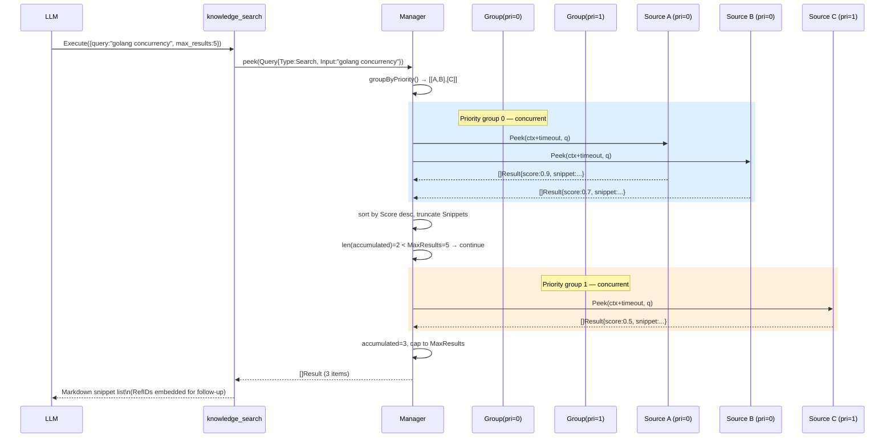
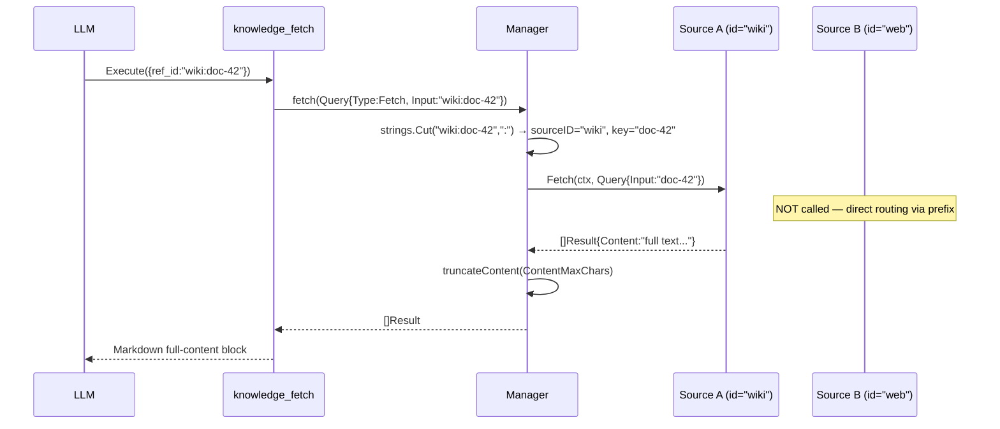
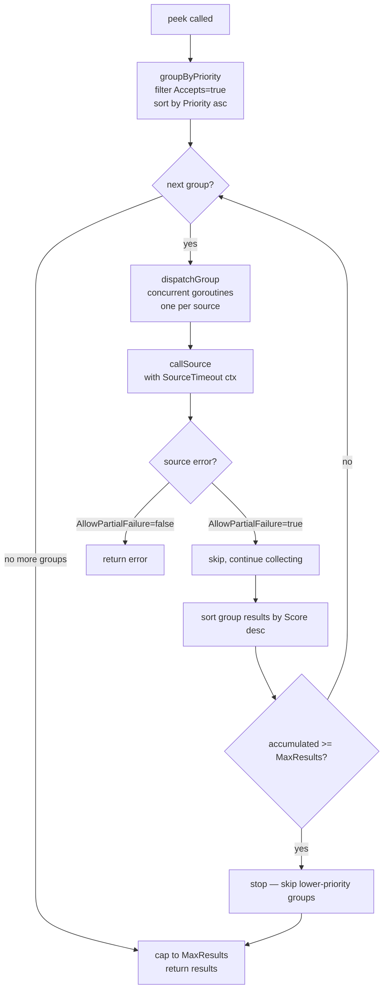
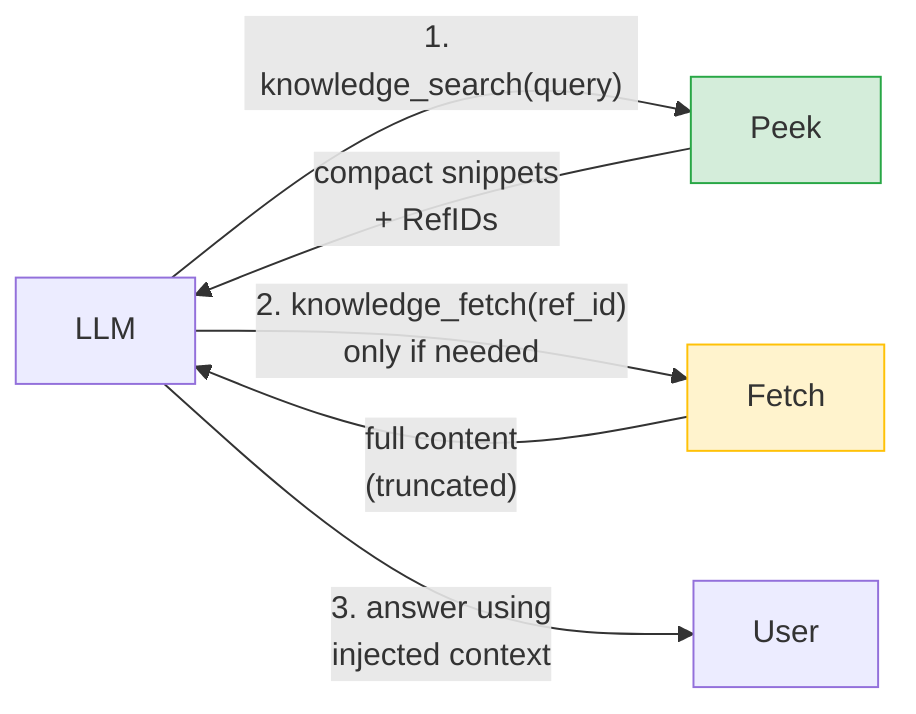

# Knowledge Manager

The `knowledge/` package is the LLM's pluggable information retrieval layer.
It exposes external knowledge backends to the model as two tool calls
(`knowledge_search`, `knowledge_fetch`) that are injected into context
**only when the LLM explicitly invokes them** — never proactively.

## Package Layout

```
llm-go/
└── knowledge/
    ├── knowledge.go          QueryType, Query, Result  — core types
    ├── source.go             Source interface           — backend contract
    ├── manager.go            Manager                   — routing & dispatch
    ├── search_tool.go        knowledge_search          — tool.Tool impl
    ├── fetch_tool.go         knowledge_fetch           — tool.Tool impl
    ├── knowledge_test.go     unit tests (14 cases)
    └── source/
        └── bleve/
            └── bleve.go      BleveSource               — reference impl
```

---

## Core Types (`knowledge.go`)

```go
type QueryType string
const (
    QueryTypeSearch QueryType = "search"  // broad exploration → Peek()
    QueryTypeFetch  QueryType = "fetch"   // precise retrieval  → Fetch()
)

type Query struct {
    Type       QueryType
    Input      string         // search terms | RefID | URL
    Filters    map[string]any // optional field constraints
    MaxResults int            // 0 = source default
}

type Result struct {
    RefID    string         // "{sourceID}:{internal-key}" — used by Fetch routing
    Title    string
    Source   string         // matches Source.ID()
    Score    float64        // [0,1]; -1 if unavailable
    Metadata map[string]any
    Snippet  string         // populated by Peek (Content empty)
    Content  string         // populated by Fetch (Snippet optional)
}
```

---

## Architecture Flow

### Search (knowledge_search → Peek)



### Fetch (knowledge_fetch → Fetch)



### Priority Group Dispatch (detail)



---

## Source Interface (`source.go`)

Every backend must implement four methods:

```go
type Source interface {
    ID()       string            // unique, URL-safe, stable  e.g. "internal-wiki"
    Priority() int               // lower = higher priority; same value = same group
    Accepts(q Query) bool        // routing filter — called before every Peek/Fetch
    Peek(ctx, q Query) ([]Result, error)   // lightweight: snippets only
    Fetch(ctx, q Query) ([]Result, error)  // full content by RefID
}
```

### Accepts() routing matrix

| Source type | QueryTypeSearch | QueryTypeFetch |
|-------------|:--------------:|:--------------:|
| BleveSource | ✓ | ✓ |
| WebSource (future) | ✓ | ✓ |
| VectorDB (future) | ✓ | ✗ |
| SQL DB (future) | ✗ | ✓ |

### RefID convention

```
Result.RefID = "{Source.ID()}:{internal-key}"
examples:
  "internal-wiki:page-42"
  "web:https://example.com/doc"
  "pg:users/row/12345"
```

Manager.fetch() uses `strings.Cut(refID, ":")` to extract the sourceID prefix
and route directly to the matching source — O(n) scan only on unknown prefixes.

---

## Registering a New Source

### Step 1 — Create the package

```
knowledge/source/
└── mybackend/
    └── mybackend.go
```

### Step 2 — Implement the interface

```go
package mybackend

import (
    "context"
    "github.com/larryhou/llm-go/knowledge"
)

type Source struct {
    id       string
    priority int
    // ... backend-specific fields (client, connection, config)
}

func New(id string, priority int /* backend args */) *Source {
    return &Source{id: id, priority: priority}
}

func (s *Source) ID() string    { return s.id }
func (s *Source) Priority() int { return s.priority }

func (s *Source) Accepts(q knowledge.Query) bool {
    // declare what this source can handle
    return q.Type == knowledge.QueryTypeSearch
}

func (s *Source) Peek(ctx context.Context, q knowledge.Query) ([]knowledge.Result, error) {
    // lightweight search — return snippets, leave Content empty
    // use q.MaxResults to cap results (default if 0)
    // RefID must be s.id + ":" + internalKey
    results := []knowledge.Result{}
    // ... backend call
    return results, nil
}

func (s *Source) Fetch(ctx context.Context, q knowledge.Query) ([]knowledge.Result, error) {
    // full content by ID
    // q.Input may still contain the "{sourceID}:" prefix — strip it if needed
    docID := strings.TrimPrefix(q.Input, s.id+":")
    // ... backend call
    return []knowledge.Result{{
        RefID:   s.id + ":" + docID,
        Title:   "...",
        Source:  s.id,
        Score:   -1,
        Content: "...",
    }}, nil
}
```

### Step 3 — Register with the Manager

```go
km := knowledge.NewManager(knowledge.ManagerConfig{
    SourceTimeout:       10 * time.Second,
    MaxResults:          5,
    SnippetMaxChars:     300,
    ContentMaxChars:     8000,
    AllowPartialFailure: true,
})

// Bleve (priority 0 — highest, local, fast)
bleveIdx, _ := bleve.Open("./index.bleve")
km.Register(blevesource.New(bleveIdx, "wiki", 0, nil))

// Your new source (priority 1 — fallback)
km.Register(mybackend.New("my-source", 1))

// Attach to RunLoop — zero other changes needed
session.RunLoop(ctx, store, session.RunInput{
    Tools: append(existingTools, km.Tools()...),
    // ...
})
```

### Step 4 — Write tests

Use a `stubSource` (see `knowledge_test.go`) to test routing logic without
a real backend. Add backend-specific integration tests in your source package.

```go
func TestMySource_Peek(t *testing.T) {
    // spin up a real or in-memory backend
    src := mybackend.New("test", 0)
    q := knowledge.Query{Type: knowledge.QueryTypeSearch, Input: "foo", MaxResults: 3}
    results, err := src.Peek(context.Background(), q)
    // assert RefID prefix, non-empty Snippet, empty Content
}
```

---

## Manager Configuration Reference

| Field | Type | Default | Effect |
|-------|------|---------|--------|
| `SourceTimeout` | `time.Duration` | 0 (inherit ctx) | Per-source deadline; ctx.Done() on timeout |
| `MaxResults` | `int` | 0 (unlimited) | Caps total Peek results; stops querying lower-priority groups early |
| `SnippetMaxChars` | `int` | 0 (no truncation) | Truncates `Result.Snippet` after Peek |
| `ContentMaxChars` | `int` | 0 (no truncation) | Truncates `Result.Content` after Fetch |
| `AllowPartialFailure` | `bool` | false | When true, a failing source is skipped; others still return results |

---

## Two-Level Retrieval Design



**Why two levels?**

- `Peek` injects only compact snippets — minimal context growth per search.
- `Fetch` is called only when the LLM decides it needs full content.
- A search returning 5 snippets × 300 chars = 1500 chars added to context.
- Only the 1–2 items actually needed get fetched (8000 chars each, on demand).
- Compaction handles old tool results automatically via `ToolOutputMaxChars`.

---

## Maintenance Checklist

### Adding a new QueryType
1. Add constant to `knowledge.go` with doc comment.
2. Update `Source.Accepts()` in all existing sources that should handle it.
3. Decide whether it routes to `Peek` or `Fetch` in `Manager.peek()`/`Manager.fetch()`.
4. Add a test in `knowledge_test.go` verifying routing.

### Changing Manager dispatch logic
- `groupByPriority()` — partitions sources; changing this affects all Peek calls.
- `dispatchGroup()` — concurrent fan-out; keep goroutine-safe.
- `fetch()` — `strings.Cut` prefix routing; keep the fallback path.

### Changing Result fields
- `Snippet` is for Peek output; keep compact (< `SnippetMaxChars`).
- `Content` is for Fetch output; may be large; always truncated by Manager.
- `RefID` format `"{sourceID}:{key}"` is a routing contract — do not change the separator.
- `Score` must be in `[0,1]` or `-1`; Manager sorts by Score descending within groups.

### BleveSource field mapping
If the Bleve index uses non-default field names, pass a `*bleve.Config`:

```go
blevesource.New(idx, "docs", 0, &blevesource.Config{
    TitleField:   "name",    // default: "title"
    ContentField: "body",    // default: "content"
})
```

---

## Key Files

| File | Purpose |
|------|---------|
| `knowledge/knowledge.go` | `QueryType`, `Query`, `Result` — edit when adding query types or result fields |
| `knowledge/source.go` | `Source` interface — the only contract all backends must satisfy |
| `knowledge/manager.go` | Routing, priority groups, concurrency, truncation — core dispatch engine |
| `knowledge/search_tool.go` | `knowledge_search` tool exposed to LLM — input schema + Peek invocation |
| `knowledge/fetch_tool.go` | `knowledge_fetch` tool exposed to LLM — input schema + Fetch invocation |
| `knowledge/knowledge_test.go` | 14 unit tests covering routing, priority, truncation, timeout, partial failure |
| `knowledge/source/bleve/bleve.go` | Reference Source implementation — use as template for new sources |
