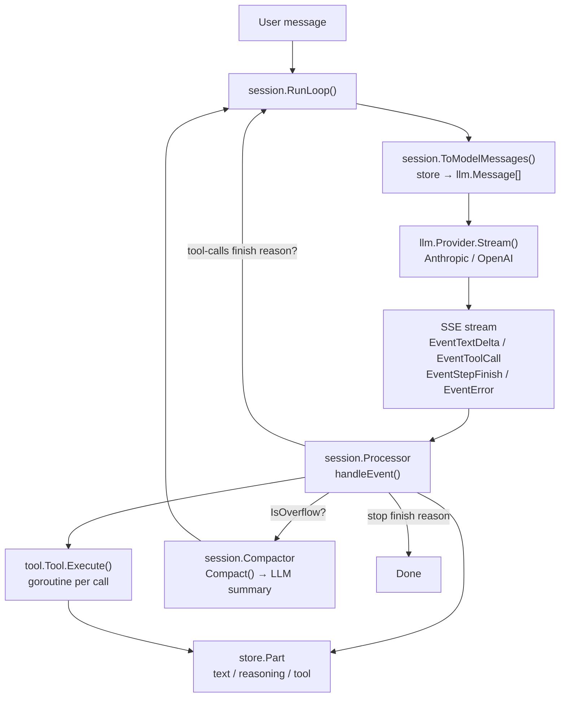
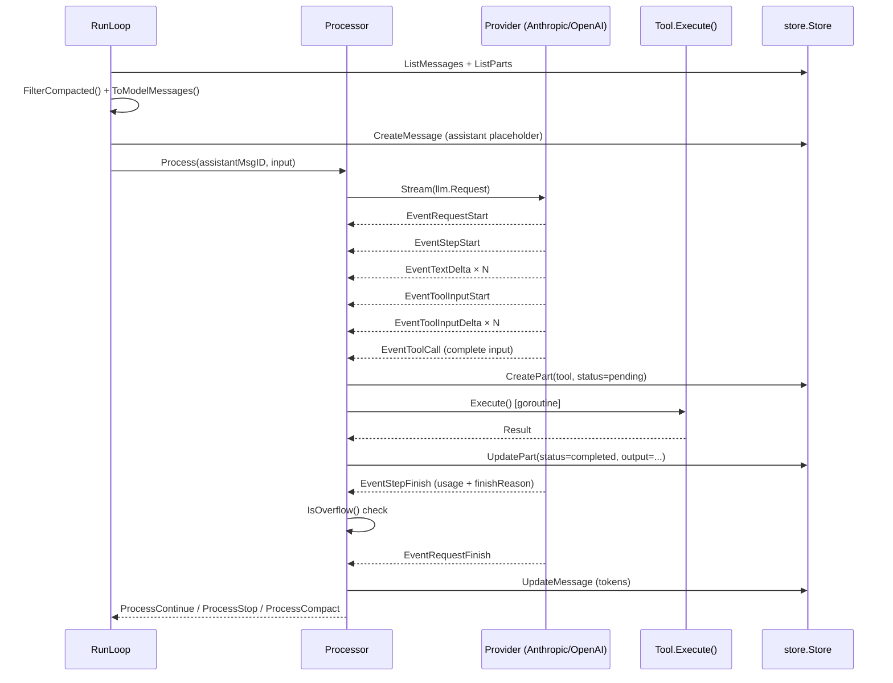
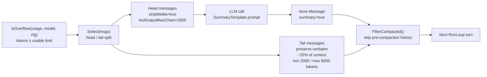
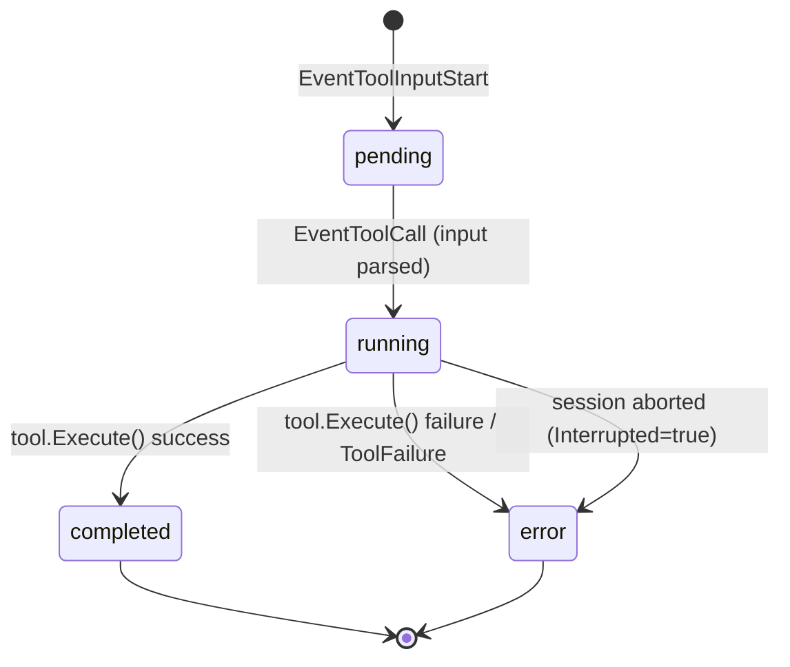

# llm-go

`llm-go` is a Go library that ports the LLM handling layer of [opencode](https://github.com/sst/opencode) to Go. It provides streaming LLM conversations, tool call orchestration, context window management (compaction), and pluggable persistence — with configuration fully compatible with opencode's `opencode.json`.

Module path: `github.com/larryhou/llm-go`

---

## Architecture

### Package Map

```
github.com/larryhou/llm-go/
├── config/      Config schema — mirrors opencode.json / opencode.jsonc
├── auth/        auth.json reader/writer — Oauth | Api | WellKnown
├── llm/         Canonical types: Message, Event, Request, LLMError, overflow, retry
├── provider/
│   ├── provider.go        Registry, Model, Info types, ParseModel()
│   ├── anthropic/         Anthropic Messages API adapter (anthropic-sdk-go)
│   └── openai/            OpenAI Chat Completions adapter (openai-go)
├── tool/        Tool interface, Registry, Truncate, builtin tools
├── store/       Store interface + memory/ implementation
└── session/
    ├── processor.go   LLM event handler — tool call lifecycle, doom-loop detection
    ├── context.go     ToModelMessages() — store records → llm.Message[]
    ├── compaction.go  Context overflow: Select(), Compact(), Prune()
    ├── prompt.go      RunLoop() — main agentic loop
    └── system.go      Per-provider system prompt selection (embedded .txt files)
```

### Data Flow



### LLM Request Pipeline



### Context Compaction



---

## Key Types

### `llm.Message` / `llm.ContentPart`

```go
// Canonical conversation message — provider-agnostic.
type Message struct {
    ID      string
    Role    string        // "user" | "assistant" | "tool"
    Content []ContentPart
}

type ContentPart struct {
    Type       string     // "text" | "tool-call" | "tool-result" | "reasoning" | "image"
    Text       string
    ToolCallID string
    ToolName   string
    Input      any        // decoded tool arguments (tool-call)
    Result     *ToolResult // tool output (tool-result)
    MediaType  string
    Data       []byte
    URL        string
}
```

### `llm.Event`

```go
type Event struct {
    Type         EventType    // see EventType constants
    Text         string       // text-delta / reasoning-delta / tool-input-delta
    ToolCallID   string
    ToolName     string
    Input        any          // tool-call: parsed args
    Output       string       // tool-result: output text
    Usage        TokenUsage   // step-finish / request-finish
    FinishReason FinishReason // stop | tool-calls | length | error
    Err          error        // error event
}
```

### `store.ToolPartData` — tool call state machine



---

## Development Guide

### Adding a New Tool

1. Implement `tool.Tool`:

```go
type MyTool struct{}

func (t *MyTool) Name()        string { return "my_tool" }
func (t *MyTool) Description() string { return "Does something useful" }
func (t *MyTool) InputSchema() map[string]any {
    return map[string]any{
        "type": "object",
        "properties": map[string]any{
            "query": map[string]any{"type": "string", "description": "The query"},
        },
        "required": []string{"query"},
    }
}

func (t *MyTool) Execute(ctx context.Context, input map[string]any) (tool.Result, error) {
    query, _ := input["query"].(string)
    if query == "" {
        return tool.Result{}, tool.Fail("query is required")
    }
    output := doWork(query)
    // Truncate if large
    tr := tool.Truncate(t.Name(), output, nil)
    return tool.Result{Output: tr.Content, Truncated: tr.Truncated, OutputPath: tr.OutputPath}, nil
}
```

2. Register it:

```go
registry := tool.NewRegistry()
registry.Register(&MyTool{})
```

### Adding a New Provider

Implement `llm.Provider`:

```go
type Provider interface {
    ID() string
    Stream(ctx context.Context, req llm.Request) (<-chan llm.Event, error)
}
```

Key requirements:
- Emit `EventRequestStart` first, then `EventStepStart` at the beginning of each agentic step
- Emit `EventToolInputStart` → `EventToolInputDelta` × N → `EventToolCall` for each tool call
- Emit `EventStepFinish` with `Usage` and `FinishReason` at the end of each step
- Emit `EventRequestFinish` when the full stream ends
- On error: emit `EventError` with `Err` set to an `*llm.LLMError`; use `llm.ClassifyHTTPError()` to classify

The provider must support `option.WithBaseURL()` or equivalent for custom endpoints.

### Error Classification

Use `llm.ClassifyHTTPError(providerID, statusCode, body, headers)` — it applies all 19 overflow patterns plus HTTP status → `ErrorKind` mapping.

For stream-level errors (JSON error events inside SSE): use `llm.ClassifyStreamError(errorType, errorCode, message)`.

```go
// Check retryability
if llm.ShouldRetry(llmErr) {
    d := llm.RetryDelay(attempt, llmErr.ResponseHeaders) // respects Retry-After header
    time.Sleep(d)
}
```

### Overflow & Compaction Constants

These are all aligned with opencode's `overflow.ts` and `compaction.ts`:

| Constant | Value | Source |
|---|---|---|
| `llm.CompactionBuffer` | 20,000 tokens | reserved before overflow triggers |
| `llm.PruneMinimum` | 20,000 tokens | minimum savings to commit a prune |
| `llm.PruneProtect` | 40,000 tokens | protect most recent tool outputs |
| `llm.ToolOutputMaxCharsCompaction` | 2,000 chars | truncation during compaction summary |
| `llm.MinPreserveRecentTokens` | 2,000 tokens | minimum tail to keep verbatim |
| `llm.MaxPreserveRecentTokens` | 8,000 tokens | maximum tail to keep verbatim |
| `session.DoomLoopThreshold` | 3 | identical tool+args calls before doom-loop |
| `session.DefaultTailTurns` | 2 | user turns to keep in tail |
| `tool.DefaultMaxLines` | 2,000 lines | tool output line limit |
| `tool.DefaultMaxBytes` | 51,200 bytes | tool output byte limit |

---

## Configuration

`llm-go` reads the same `opencode.json` as opencode. Config is loaded from (in order, later files merge/override):

1. `$XDG_CONFIG_HOME/opencode/opencode.json`
2. `~/.config/opencode/opencode.json`
3. `.opencode/opencode.json` (project-local)

Auth is read from `$XDG_DATA_HOME/opencode/auth.json` (default: `~/.local/share/opencode/auth.json`).

### Minimal Config Example

```jsonc
{
  "$schema": "https://opencode.ai/config.json",
  "model": "anthropic/claude-sonnet-4-5",
  "provider": {
    "anthropic": {
      "options": {
        "apiKey": "sk-ant-..."
      }
    }
  }
}
```

### Custom Endpoint (OpenAI-compatible)

```jsonc
{
  "provider": {
    "ollama": {
      "api": "http://localhost:11434/v1",
      "options": {
        "apiKey": "ollama"
      },
      "models": {
        "llama3": {
          "limit": { "context": 8192, "output": 2048 }
        }
      }
    }
  }
}
```

### Compaction Tuning

```jsonc
{
  "compaction": {
    "auto": true,
    "tail_turns": 3,
    "preserve_recent_tokens": 6000,
    "reserved": 15000
  }
}
```

---

## Usage Examples

### Minimal streaming conversation

```go
package main

import (
    "context"
    "fmt"

    "github.com/larryhou/llm-go/auth"
    "github.com/larryhou/llm-go/config"
    anthropicprov "github.com/larryhou/llm-go/provider/anthropic"
    "github.com/larryhou/llm-go/llm"
)

func main() {
    cfg, _ := config.Load()
    authStore, _ := auth.Load()

    prov, err := anthropicprov.NewFromConfig(cfg.Provider["anthropic"], authStore)
    if err != nil {
        panic(err)
    }

    client := llm.NewClient(prov)
    req := llm.Request{
        Model: llm.Model{APIID: "claude-sonnet-4-5", Limit: llm.ModelLimit{Context: 200000, Output: 8192}},
        System: []string{"You are a helpful assistant."},
        Messages: []llm.Message{llm.NewUserMessage("Hello!")},
    }

    for ev := range client.Stream(context.Background(), req) {
        switch ev.Type {
        case llm.EventTextDelta:
            fmt.Print(ev.Text)
        case llm.EventRequestFinish:
            fmt.Printf("\n[tokens: input=%d output=%d]\n", ev.Usage.Input, ev.Usage.Output)
        case llm.EventError:
            panic(ev.Err)
        }
    }
}
```

### Full agentic loop with tools and persistence

```go
package main

import (
    "context"

    "github.com/larryhou/llm-go/auth"
    "github.com/larryhou/llm-go/config"
    "github.com/larryhou/llm-go/llm"
    anthropicprov "github.com/larryhou/llm-go/provider/anthropic"
    "github.com/larryhou/llm-go/session"
    "github.com/larryhou/llm-go/store/memory"
    "github.com/larryhou/llm-go/tool"
)

func main() {
    cfg, _ := config.Load()
    authStore, _ := auth.Load()

    prov, _ := anthropicprov.NewFromConfig(cfg.Provider["anthropic"], authStore)

    // In-memory store (replace with store/sqlite for persistence)
    s := memory.New()

    // Create a session
    ctx := context.Background()
    _ = s.CreateSession(ctx, &store.Session{ID: "sess-1", Model: "anthropic/claude-sonnet-4-5"})

    // Register tools
    registry := tool.NewRegistry()
    // registry.Register(&builtin.ShellTool{})

    result, err := session.RunLoop(ctx, s, session.RunInput{
        SessionID: "sess-1",
        UserMsg:   "What files are in the current directory?",
        Model: llm.Model{
            ID:         "claude-sonnet-4-5",
            ProviderID: "anthropic",
            APIID:      "claude-sonnet-4-5",
            Limit:      llm.ModelLimit{Context: 200_000, Output: 8192},
        },
        Tools:    registry.All(),
        Provider: prov,
        Config:   cfg,
        MaxSteps: 10,
    })
    _ = result
    _ = err
}
```

---

## Maintenance Notes

### Syncing with opencode upstream

When opencode updates its LLM handling, the following files should be checked for alignment:

| opencode source | llm-go equivalent |
|---|---|
| `packages/opencode/src/session/overflow.ts` | `llm/overflow.go` — constants + `IsOverflow()` / `Usable()` |
| `packages/opencode/src/session/retry.ts` | `llm/error.go` — `RetryDelay()` / `ShouldRetry()` |
| `packages/opencode/src/provider/error.ts` | `llm/error.go` — overflow regex patterns, `ClassifyHTTPError()` |
| `packages/opencode/src/session/compaction.ts` | `session/compaction.go` — `Select()` / `Compact()` / `Prune()` |
| `packages/opencode/src/session/message-v2.ts` | `session/context.go` — `ToModelMessages()` |
| `packages/opencode/src/session/processor.ts` | `session/processor.go` — `handleEvent()` / `cleanup()` |
| `packages/opencode/src/session/prompt/*.txt` | `session/*.txt` — embedded system prompts |
| `packages/opencode/src/tool/truncate.ts` | `tool/truncate.go` — `DefaultMaxLines` / `DefaultMaxBytes` |

### Overflow pattern updates

The 19 overflow regex patterns in `llm/error.go` (`overflowPatterns` var) must be kept in sync with `packages/opencode/src/provider/error.ts` `OVERFLOW_PATTERNS`. When a new LLM provider is added to opencode, check if new patterns were added.

### Adding a new provider SDK

1. Add the dependency: `go get github.com/new-provider/sdk-go`
2. Create `provider/newprovider/newprovider.go` implementing `llm.Provider`
3. Follow the event emission contract described in "Adding a New Provider" above
4. Register in your application via `provider.Registry.Register()`

### SDK version updates

Both provider SDKs are vendored via `go mod vendor`. To update:

```bash
go get github.com/anthropics/anthropic-sdk-go@latest
go get github.com/openai/openai-go@latest
go mod tidy
go mod vendor
go build ./...
```

Both SDKs generate code from OpenAPI specs via Stainless. After an update, verify that struct field names for streaming types (`MessageStreamEventUnion`, `ChatCompletionChunk`) haven't changed.
