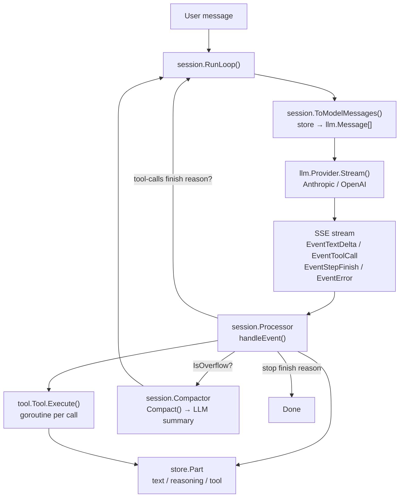
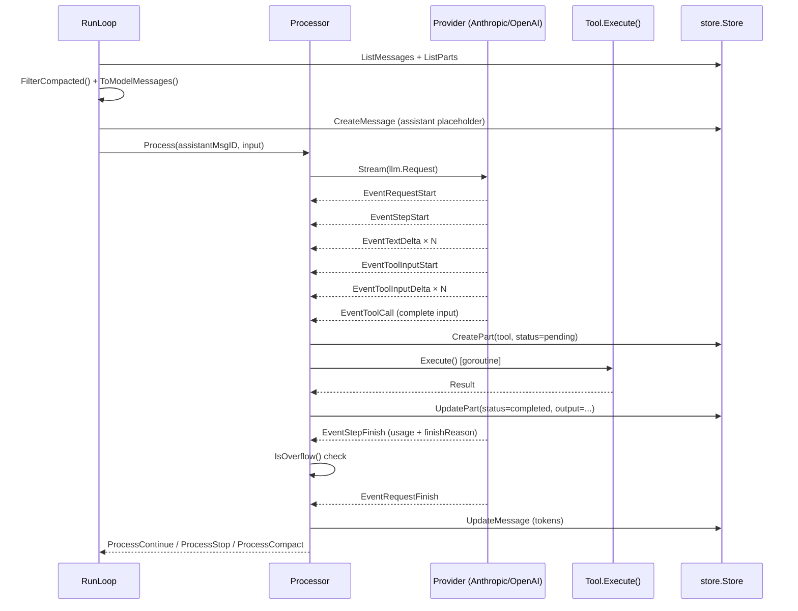
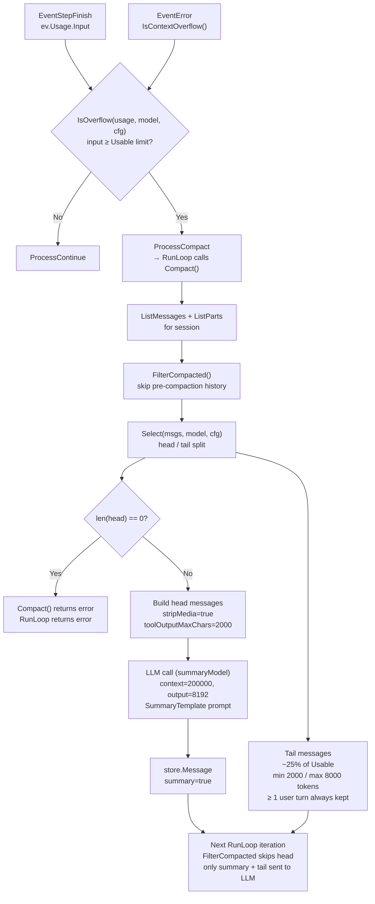
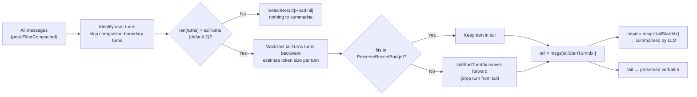
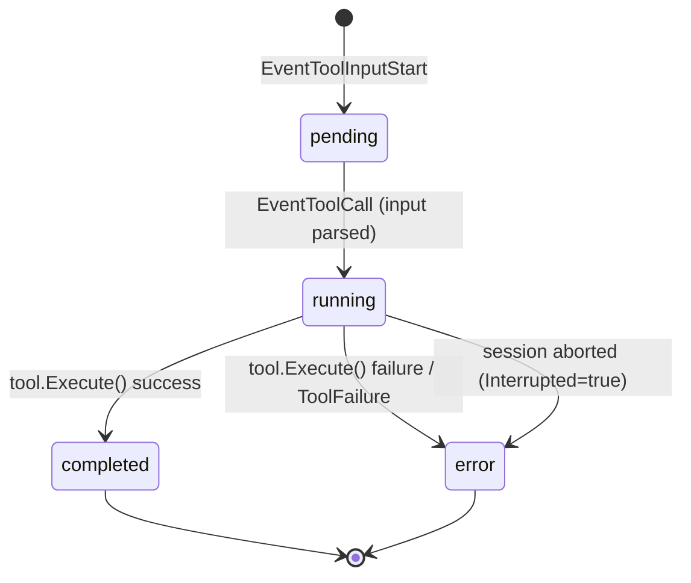

# llm-go

`llm-go` is a Go library that ports the LLM handling layer of [opencode](https://github.com/sst/opencode) to Go. It provides streaming LLM conversations, tool call orchestration, context window management (compaction), and pluggable persistence — with configuration fully compatible with opencode's `opencode.json`.

Module path: `github.com/larryhou/llm-go`

---

## Architecture

### Package Map

```
github.com/larryhou/llm-go/
├── config/      Config schema — mirrors opencode.json / opencode.jsonc
├── auth/        auth.json reader/writer — Oauth | Api | WellKnown
├── llm/         Canonical types: Message, Event, Request, LLMError, overflow, retry
├── provider/
│   ├── provider.go        Registry, Model, Info types, ParseModel()
│   ├── anthropic/         Anthropic Messages API adapter (anthropic-sdk-go)
│   └── openai/            OpenAI Chat Completions adapter (openai-go)
├── tool/        Tool interface, Registry, Truncate, builtin tools
├── store/       Store interface + memory/ implementation
└── session/
    ├── processor.go   LLM event handler — tool call lifecycle, doom-loop detection
    ├── context.go     ToModelMessages() — store records → llm.Message[]
    ├── compaction.go  Context overflow: Select(), Compact(), Prune()
    ├── prompt.go      RunLoop() — main agentic loop
    ├── system.go      Per-provider system prompt selection (embedded .txt files)
    └── max-steps.txt  Prefilled assistant prompt injected on the last agentic step
```

### Data Flow



### LLM Request Pipeline



### Context Compaction

Compaction is triggered when `IsOverflow()` returns true after a step, or when the provider returns a context-overflow error. It replaces old history with an LLM-generated summary, keeping only the most recent turns verbatim.



#### Usable limit calculation (`llm/overflow.go`)

```
MaxOutputTokens = min(model.limit.output, 32000)
reserved        = cfg.compaction.reserved ?? min(CompactionBuffer=20000, MaxOutputTokens)

if model.limit.input set:
    Usable = model.limit.input  - reserved
else:
    Usable = model.limit.context - MaxOutputTokens
```

Example with `-context-limit 128000` and `output=8192`:
```
MaxOutputTokens = 8192
reserved        = min(20000, 8192) = 8192
Usable          = 128000 - 8192   = 119,808  ← compact triggers here
```

#### head / tail split (`session/compaction.go Select()`)



### MaxSteps — graceful termination

When `RunInput.MaxSteps > 0` and `step >= MaxSteps`, the loop does **not** terminate silently. Instead, aligned with `opencode/src/session/prompt.ts` `isLastStep` handling:

1. A prefilled `role: "assistant"` message with `session.PromptMaxSteps` content is appended to `modelMsgs` — the LLM sees its "own" opening and continues naturally with a text summary.
2. `tools` is set to `nil` — the provider receives no tool definitions, forcing a text-only response.
3. After this final LLM turn completes, the loop terminates regardless of `ProcessResult`.

```go
// session/prompt.go (simplified)
isLastStep := input.MaxSteps > 0 && step >= input.MaxSteps

if isLastStep {
    modelMsgs = append(modelMsgs, llm.Message{
        Role:    "assistant",
        Content: []llm.ContentPart{{Type: "text", Text: PromptMaxSteps}},
    })
    tools = nil   // force text-only response
}
```

`session.PromptMaxSteps` is exported from `session/system.go` (embedded from `session/max-steps.txt`).

---

### Prune — tool output trimming

Prune is a lighter alternative to full compaction: instead of replacing history with a summary, it **clears old tool output content** in-place, freeing context without changing the message structure.

> **Current status**: `Prune()` is implemented in `session/compaction.go` but is **not called anywhere** in the current codebase. It is available for future use as a pre-compaction or degraded-compaction strategy.


#### What happens to pruned tool outputs

After `Prune()`, when `ToModelMessages()` builds the next request, any part with `Compacted > 0` emits:

```
[Old tool result content cleared]
```

instead of the original output. The tool call itself (name + input) is preserved in the assistant message — only the result content is replaced.

#### Prune vs Compact comparison

| | Prune | Compact |
|---|---|---|
| Trigger | manual / future strategy | `IsOverflow()` or provider overflow error |
| Currently called | no (dead code) | yes, via `RunLoop` → `Compactor.Compact()` |
| Message count | unchanged | large reduction (head → 1 summary message) |
| History structure | intact | head replaced by summary + compaction boundary |
| input token drop | small (tool outputs only) | large |
| LLM call required | no | yes (summary generation) |
| Crosses summary boundary | no (stops at summary) | creates new summary |

---

## Key Types

### `llm.Message` / `llm.ContentPart`

```go
// Canonical conversation message — provider-agnostic.
type Message struct {
    ID      string
    Role    string        // "user" | "assistant" | "tool"
    Content []ContentPart
}

type ContentPart struct {
    Type       string     // "text" | "tool-call" | "tool-result" | "reasoning" | "image"
    Text       string
    ToolCallID string
    ToolName   string
    Input      any        // decoded tool arguments (tool-call)
    Result     *ToolResult // tool output (tool-result)
    MediaType  string
    Data       []byte
    URL        string
}
```

### `llm.Event`

```go
type Event struct {
    Type         EventType    // see EventType constants
    Text         string       // text-delta / reasoning-delta / tool-input-delta
    ToolCallID   string
    ToolName     string
    Input        any          // tool-call: parsed args
    Output       string       // tool-result: output text
    Usage        TokenUsage   // step-finish / request-finish
    FinishReason FinishReason // stop | tool-calls | length | error
    Err          error        // error event
}
```

### `store.ToolPartData` — tool call state machine



---

## Development Guide

### Adding a New Tool

1. Implement `tool.Tool`:

```go
type MyTool struct{}

func (t *MyTool) Name()        string { return "my_tool" }
func (t *MyTool) Description() string { return "Does something useful" }
func (t *MyTool) InputSchema() map[string]any {
    return map[string]any{
        "type": "object",
        "properties": map[string]any{
            "query": map[string]any{"type": "string", "description": "The query"},
        },
        "required": []string{"query"},
    }
}

func (t *MyTool) Execute(ctx context.Context, input map[string]any) (tool.Result, error) {
    query, _ := input["query"].(string)
    if query == "" {
        return tool.Result{}, tool.Fail("query is required")
    }
    output := doWork(query)
    // Truncate if large
    tr := tool.Truncate(t.Name(), output, nil)
    return tool.Result{Output: tr.Content, Truncated: tr.Truncated, OutputPath: tr.OutputPath}, nil
}
```

2. Register it:

```go
registry := tool.NewRegistry()
registry.Register(&MyTool{})
```

### Adding a New Provider

Implement `llm.Provider`:

```go
type Provider interface {
    ID() string
    Stream(ctx context.Context, req llm.Request) (<-chan llm.Event, error)
}
```

Key requirements:
- Emit `EventRequestStart` first, then `EventStepStart` at the beginning of each agentic step
- Emit `EventToolInputStart` → `EventToolInputDelta` × N → `EventToolCall` for each tool call
- Emit `EventStepFinish` with `Usage` and `FinishReason` at the end of each step
- Emit `EventRequestFinish` when the full stream ends
- On error: emit `EventError` with `Err` set to an `*llm.LLMError`; use `llm.ClassifyHTTPError()` to classify

The provider must support `option.WithBaseURL()` or equivalent for custom endpoints.

### SDK BaseURL Quirks
When configuring custom endpoints (e.g. proxies or OpenAI wrappers), be aware of the underlying SDK routing logic:
- **Anthropic**: The `anthropic-sdk-go` will automatically append the specific resource paths (like `/v1/messages`) to the `BaseURL`. Therefore, you should NOT include `/v1` or `/v1/messages` in the BaseURL (e.g., use `http://192.168.3.119:8080/claude` instead of `http://192.168.3.119:8080/claude/v1`).
- **OpenAI**: The `openai-go` SDK (or compatible proxies) usually expects the `/v1` to be part of the BaseURL (e.g., `http://192.168.3.119:8080/timi-claude/v1`).
- **Tool Use Inputs**: Anthropic natively requires tool arguments to be provided as a proper JSON object. When implementing `Provider.Stream`, do not JSON-marshal `llm.PartTypeToolCall.Input` to a string before passing it into `anthropic.NewToolUseBlock`, as it expects an `any` interface and stringifying it will result in `unexpected EOF` or 400 errors from strict proxy endpoints.

### Error Classification

Use `llm.ClassifyHTTPError(providerID, statusCode, body, headers)` — it applies all 19 overflow patterns plus HTTP status → `ErrorKind` mapping.

For stream-level errors (JSON error events inside SSE): use `llm.ClassifyStreamError(errorType, errorCode, message)`.

```go
// Check retryability
if llm.ShouldRetry(llmErr) {
    d := llm.RetryDelay(attempt, llmErr.ResponseHeaders) // respects Retry-After header
    time.Sleep(d)
}
```

### Overflow & Compaction Constants

These are all aligned with opencode's `overflow.ts` and `compaction.ts`:

| Constant | Value | Source |
|---|---|---|
| `llm.CompactionBuffer` | 20,000 tokens | reserved before overflow triggers |
| `llm.PruneMinimum` | 20,000 tokens | minimum savings to commit a prune |
| `llm.PruneProtect` | 40,000 tokens | protect most recent tool outputs |
| `llm.ToolOutputMaxCharsCompaction` | 2,000 chars | truncation during compaction summary |
| `llm.MinPreserveRecentTokens` | 2,000 tokens | minimum tail to keep verbatim |
| `llm.MaxPreserveRecentTokens` | 8,000 tokens | maximum tail to keep verbatim |
| `session.DoomLoopThreshold` | 3 | identical tool+args calls before doom-loop |
| `session.DefaultTailTurns` | 2 | user turns to keep in tail |
| `tool.DefaultMaxLines` | 2,000 lines | tool output line limit |
| `tool.DefaultMaxBytes` | 51,200 bytes | tool output byte limit |

---

## Configuration

`llm-go` uses its own config path, separate from opencode.

| File | Path |
|---|---|
| Global config | `~/.config/llm/llm.json` (or `$XDG_CONFIG_HOME/llm/llm.json`) |
| Project-local config | `.llm/llm.json` (in the working directory) |
| Auth tokens / API keys | `~/.config/llm/auth.json` |

Both files are loaded in order; the project-local file overrides the global one.

`config.ConfigDir()` returns the effective config directory (`$XDG_CONFIG_HOME/llm` or `~/.config/llm`).

### Minimal Config Example

```jsonc
// ~/.config/llm/llm.json
{
  "model": "anthropic/claude-sonnet-4-5",
  "provider": {
    "anthropic": {
      "options": {
        "apiKey": "sk-ant-..."
      }
    }
  }
}
```

### Custom Endpoint (OpenAI-compatible)

```jsonc
// ~/.config/llm/llm.json
{
  "provider": {
    "ollama": {
      "api": "http://localhost:11434/v1",
      "options": {
        "apiKey": "ollama"
      },
      "models": {
        "llama3": {
          "limit": { "context": 8192, "output": 2048 }
        }
      }
    }
  }
}
```

### Compaction Tuning

```jsonc
// ~/.config/llm/llm.json
{
  "compaction": {
    "auto": true,
    "tail_turns": 3,
    "preserve_recent_tokens": 6000,
    "reserved": 15000
  }
}
```

---

## Usage Examples

### Minimal streaming conversation

```go
package main

import (
    "context"
    "fmt"

    "github.com/larryhou/llm-go/auth"
    "github.com/larryhou/llm-go/config"
    anthropicprov "github.com/larryhou/llm-go/provider/anthropic"
    "github.com/larryhou/llm-go/llm"
)

func main() {
    cfg, _ := config.Load()
    authStore, _ := auth.Load()

    prov, err := anthropicprov.NewFromConfig(cfg.Provider["anthropic"], authStore)
    if err != nil {
        panic(err)
    }

    client := llm.NewClient(prov)
    req := llm.Request{
        Model: llm.Model{APIID: "claude-sonnet-4-5", Limit: llm.ModelLimit{Context: 200000, Output: 8192}},
        System: []string{"You are a helpful assistant."},
        Messages: []llm.Message{llm.NewUserMessage("Hello!")},
    }

    for ev := range client.Stream(context.Background(), req) {
        switch ev.Type {
        case llm.EventTextDelta:
            fmt.Print(ev.Text)
        case llm.EventRequestFinish:
            fmt.Printf("\n[tokens: input=%d output=%d]\n", ev.Usage.Input, ev.Usage.Output)
        case llm.EventError:
            panic(ev.Err)
        }
    }
}
```

### System prompt control

`RunInput` exposes three fields that mirror opencode's `session/llm.ts` prompt assembly:

```
agentPrompt || providerPrompt  ← exactly one base prompt
+ ExtraSystem[]                ← always appended
```

| Field | Type | Behaviour |
|---|---|---|
| `AgentPrompt` | `string` | When non-empty, replaces the embedded provider prompt entirely (same as `agent.prompt` in opencode) |
| `DisableProviderPrompt` | `bool` | When `true` and `AgentPrompt` is empty, suppresses the embedded provider prompt; only `ExtraSystem` is sent |
| `ExtraSystem` | `[]string` | Always appended after the base prompt (corresponds to `input.system` in opencode) |

```go
// Use a custom agent prompt (provider prompt suppressed automatically)
session.RunLoop(ctx, s, session.RunInput{
    AgentPrompt: "You are a specialist Go code reviewer. Be concise.",
    ExtraSystem: []string{"Focus on performance issues."},
    ...
})

// Suppress the provider prompt, provide everything yourself
session.RunLoop(ctx, s, session.RunInput{
    DisableProviderPrompt: true,
    ExtraSystem: []string{"You are a helpful assistant."},
    ...
})

// Default: embedded per-provider prompt + your extra instructions
session.RunLoop(ctx, s, session.RunInput{
    ExtraSystem: []string{"Always respond in Chinese."},
    ...
})
```

### Full agentic loop with tools and persistence

```go
package main

import (
    "context"

    "github.com/larryhou/llm-go/auth"
    "github.com/larryhou/llm-go/config"
    "github.com/larryhou/llm-go/llm"
    anthropicprov "github.com/larryhou/llm-go/provider/anthropic"
    "github.com/larryhou/llm-go/session"
    "github.com/larryhou/llm-go/store/memory"
    "github.com/larryhou/llm-go/tool"
)

func main() {
    cfg, _ := config.Load()
    authStore, _ := auth.Load()

    prov, _ := anthropicprov.NewFromConfig(cfg.Provider["anthropic"], authStore)

    // In-memory store (replace with store/sqlite for persistence)
    s := memory.New()

    // Create a session
    ctx := context.Background()
    _ = s.CreateSession(ctx, &store.Session{ID: "sess-1", Model: "anthropic/claude-sonnet-4-5"})

    // Register tools
    registry := tool.NewRegistry()
    // registry.Register(&builtin.ShellTool{})

    result, err := session.RunLoop(ctx, s, session.RunInput{
        SessionID: "sess-1",
        UserMsg:   "What files are in the current directory?",
        Model: llm.Model{
            ID:         "claude-sonnet-4-5",
            ProviderID: "anthropic",
            APIID:      "claude-sonnet-4-5",
            Limit:      llm.ModelLimit{Context: 200_000, Output: 8192},
        },
        Tools:    registry.All(),
        Provider: prov,
        Config:   cfg,
        MaxSteps: 10,
    })
    _ = result
    _ = err
}
```

---

## Maintenance Notes

### Syncing with opencode upstream

When opencode updates its LLM handling, the following files should be checked for alignment:

| opencode source | llm-go equivalent |
|---|---|
| `packages/opencode/src/session/overflow.ts` | `llm/overflow.go` — constants + `IsOverflow()` / `Usable()` |
| `packages/opencode/src/session/retry.ts` | `llm/error.go` — `RetryDelay()` / `ShouldRetry()` |
| `packages/opencode/src/provider/error.ts` | `llm/error.go` — overflow regex patterns, `ClassifyHTTPError()` |
| `packages/opencode/src/session/compaction.ts` | `session/compaction.go` — `Select()` / `Compact()` / `Prune()` |
| `packages/opencode/src/session/message-v2.ts` | `session/context.go` — `ToModelMessages()` |
| `packages/opencode/src/session/processor.ts` | `session/processor.go` — `handleEvent()` / `cleanup()` |
| `packages/opencode/src/session/prompt/*.txt` | `session/*.txt` — embedded system prompts |
| `packages/opencode/src/tool/truncate.ts` | `tool/truncate.go` — `DefaultMaxLines` / `DefaultMaxBytes` |

### Overflow pattern updates

The 19 overflow regex patterns in `llm/error.go` (`overflowPatterns` var) must be kept in sync with `packages/opencode/src/provider/error.ts` `OVERFLOW_PATTERNS`. When a new LLM provider is added to opencode, check if new patterns were added.

### Adding a new provider SDK

1. Add the dependency: `go get github.com/new-provider/sdk-go`
2. Create `provider/newprovider/newprovider.go` implementing `llm.Provider`
3. Follow the event emission contract described in "Adding a New Provider" above
4. Register in your application via `provider.Registry.Register()`

### SDK version updates

Both provider SDKs are vendored via `go mod vendor`. To update:

```bash
go get github.com/anthropics/anthropic-sdk-go@latest
go get github.com/openai/openai-go@latest
go mod tidy
go mod vendor
go build ./...
```

Both SDKs generate code from OpenAPI specs via Stainless. After an update, verify that struct field names for streaming types (`MessageStreamEventUnion`, `ChatCompletionChunk`) haven't changed.
