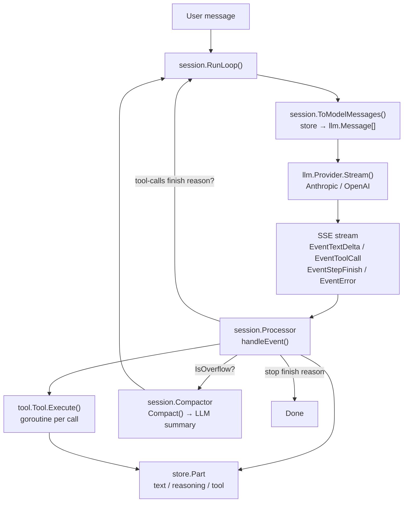
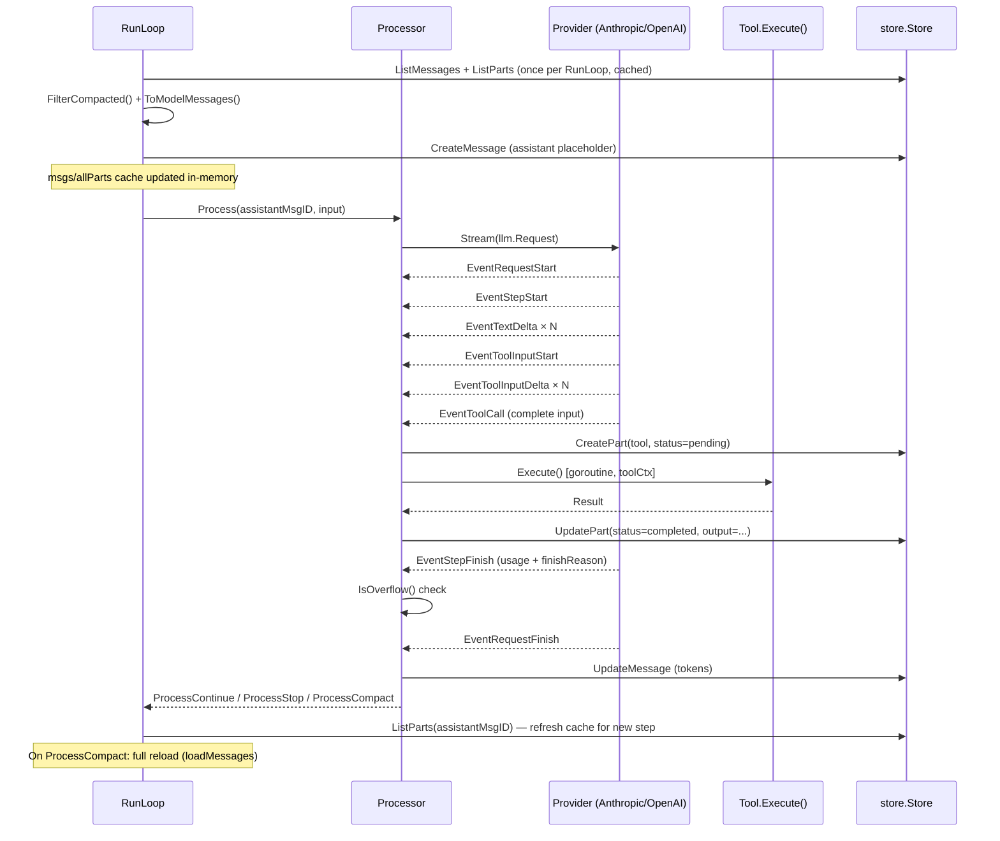
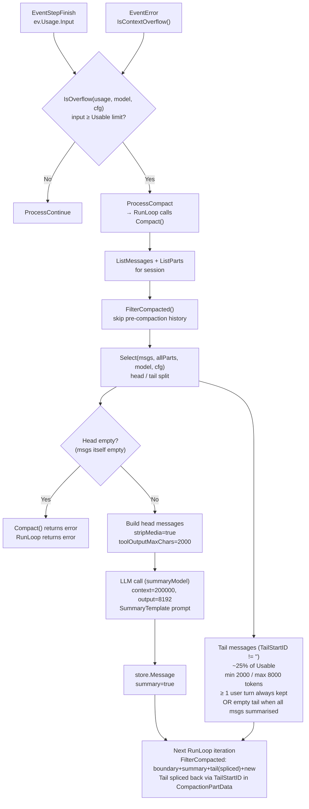
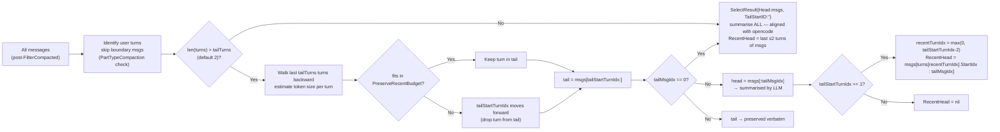
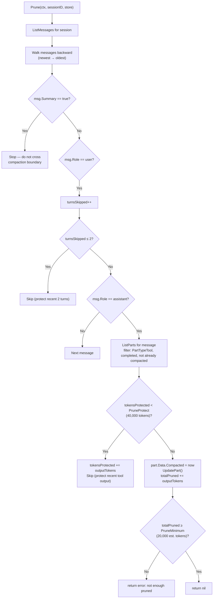
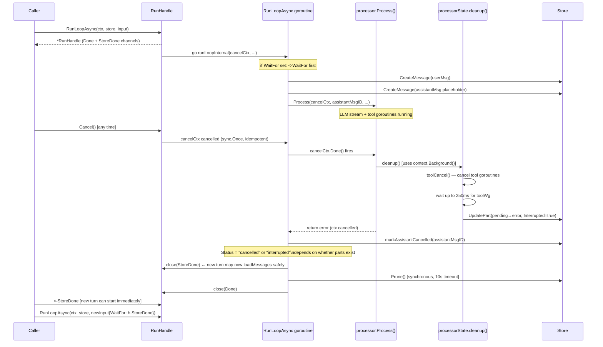
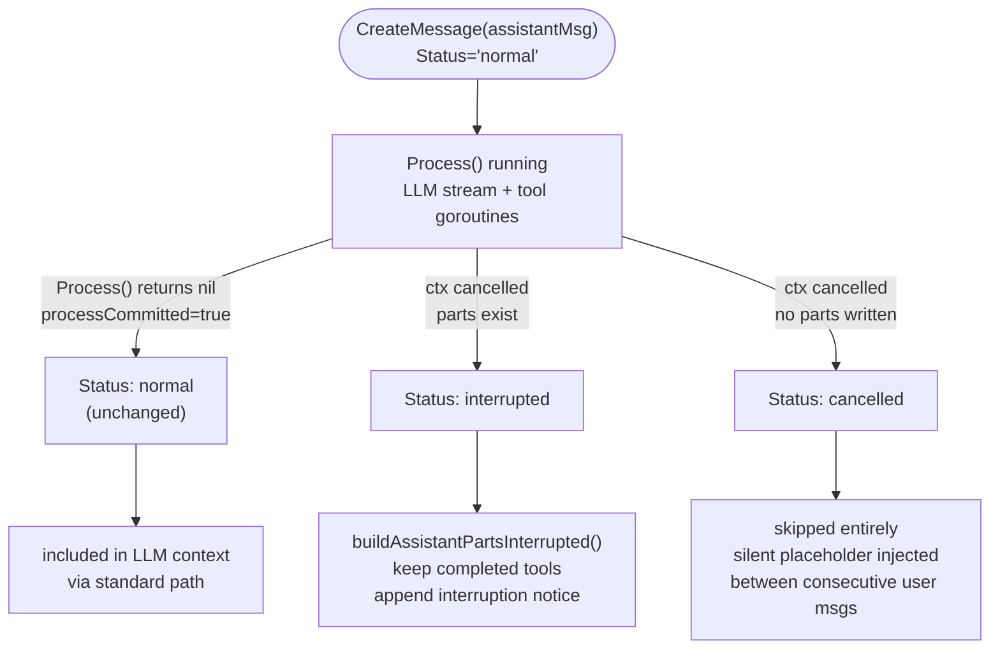
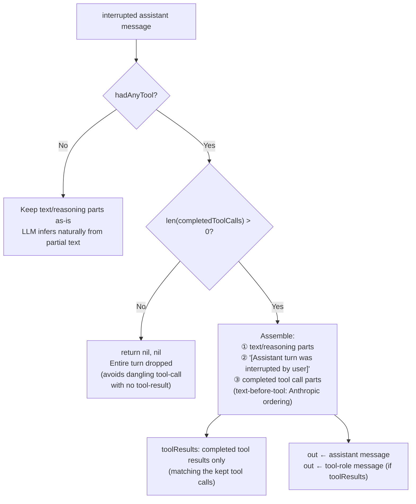
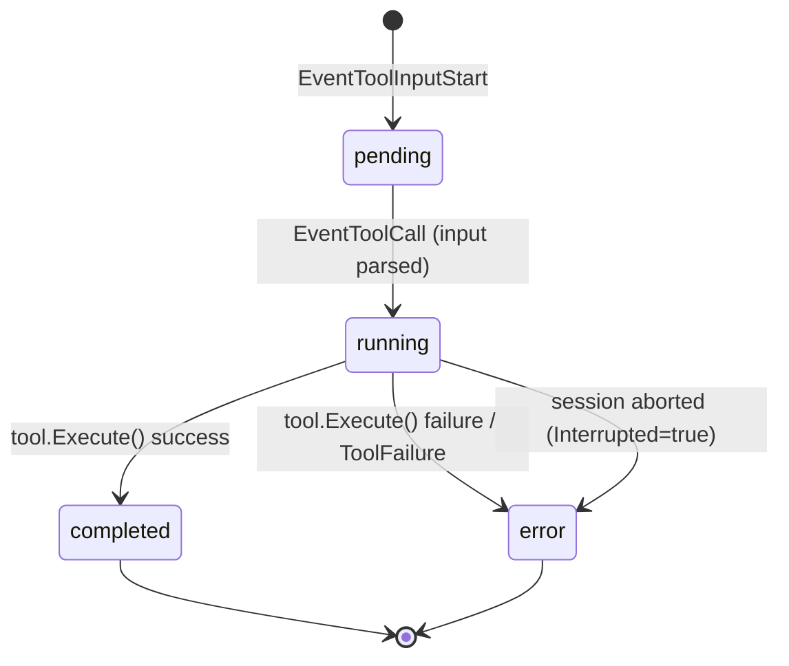

# llm-go

`llm-go` is a Go library that ports the LLM handling layer of [opencode](https://github.com/sst/opencode) to Go. It provides streaming LLM conversations, tool call orchestration, context window management (compaction), and pluggable persistence — with configuration fully compatible with opencode's `opencode.json`.

Module path: `github.com/larryhou/llm-go`

---

## Architecture

### Package Map

```
github.com/larryhou/llm-go/
├── config/      Config schema — mirrors opencode.json / opencode.jsonc
├── auth/        auth.json reader/writer — Oauth | Api | WellKnown
├── llm/         Canonical types: Message, Event, Request, LLMError, overflow, retry
├── provider/
│   ├── provider.go        Registry, Model, Info types, ParseModel()
│   ├── anthropic/         Anthropic Messages API adapter (anthropic-sdk-go)
│   └── openai/            OpenAI Chat Completions adapter (openai-go)
├── tool/        Tool interface, Registry, Truncate, builtin tools
├── store/       Store interface (incl. DeleteSession) + memory/ implementation
└── session/
    ├── processor.go   LLM event handler — tool call lifecycle, doom-loop detection
    ├── context.go     ToModelMessages() — store records → llm.Message[]
    ├── compaction.go  Context overflow: Select(), Compact(), Prune()
    ├── prompt.go      RunLoop() — main agentic loop
    ├── reset_tool.go  session_reset built-in tool
    ├── system.go      Per-provider system prompt selection (embedded .txt files)
    └── max-steps.txt  User message injected on the last agentic step (MaxSteps reached)
```

### Data Flow



### LLM Request Pipeline



### Context Compaction

Compaction is triggered when `IsOverflow()` returns true after a step, or when the provider returns a context-overflow error. It replaces old history with an LLM-generated summary, keeping only the most recent turns verbatim.



#### Usable limit calculation (`llm/overflow.go`)

```
MaxOutputTokens = min(model.limit.output, 32000)
reserved        = cfg.compaction.reserved ?? min(CompactionBuffer=20000, MaxOutputTokens)

if model.limit.input set:
    Usable = model.limit.input  - reserved
else:
    Usable = model.limit.context - MaxOutputTokens
```

Example with `-context-limit 128000` and `output=8192`:
```
MaxOutputTokens = 8192
reserved        = min(20000, 8192) = 8192
Usable          = 128000 - 8192   = 119,808  ← compact triggers here
```

#### head / tail split (`session/compaction.go Select()`)

`Select(msgs, allParts, model, cfg)` — note `allParts` is now required. It uses `hasPartType(allParts[m.ID], PartTypeCompaction)` to identify compaction boundary user messages, consistent with `FilterCompacted`. The old positional heuristic (`msgs[i+1].Summary`) has been removed.

`SelectResult` now carries a `RecentHead` field — the messages belonging to the last ≤2 real user turns within `Head` (immediately before the tail). `RecentHead` is populated in **all** compaction paths including the AllHead path (`len(turns) <= tailTurns` or `tailMsgIdx == 0`). It is `nil` only when `Head` is truly empty (no user turns at all). When head has only 1 turn, `recentTurnIdx` clamps to 0 so that single turn is still captured.

```go
type SelectResult struct {
    Head        []*store.Message
    TailStartID string
    RecentHead  []*store.Message // last ≤2 turns of Head closest to tail; nil only when Head has no user turns
}
```



#### Recent-context anchor (`PartTypeRecentContext`, `store/store.go`)

After compaction, the LLM only sees `[summary + recent tail turns]`. The turns immediately before the tail are the ones most likely to be mis-summarised by the summary LLM, yet they are the most relevant to the current topic.

**Step 6** of `Compact()` (non-fatal, does not roll back compaction) writes a `PartTypeRecentContext` part onto the boundary message containing a verbatim excerpt of `sel.RecentHead`:

```go
// store/store.go
PartTypeRecentContext = "recent-context"

type RecentContextPartData struct {
    Excerpt string // verbatim rendered excerpt of the last 2 turns of head
}
```

Excerpt format (rendered by `buildRecentContextExcerpt`):
```
---
以下是压缩前最近的对话原文：

**[用户]**
<user text, max 300 runes>...

**[助手]**
- 调用工具: <tool_name> → <output, max 120 runes>...
<assistant text, max 300 runes>...
```

- Text is truncated at rune boundaries (not byte boundaries) using `utf8.RuneCountInString`.
- Role labels are only written when the message has actual text or tool content (`hasContent` guard).
- If `RecentHead` is nil (no user turns in head) or produces no text/tool content, Step 6 is skipped entirely.

After writing the part, `Compact()` calls `store.GetMessage` + `store.UpdateMessage` to set `boundary.Tokens.Input = len(excerpt)/4` — preventing `estimateTurnTokens` from under-counting the boundary message on the next compaction round (fallback is 500 for user messages, 300 for others).

#### `buildUserParts` and `StripMedia` (`session/context.go`)

`buildUserParts` now accepts a `ToModelOptions` parameter:

```go
func buildUserParts(ps []*store.Part, opts ToModelOptions) []llm.ContentPart
```

When `opts.StripMedia = true` (used in the summary generation path), `PartTypeRecentContext` parts are skipped. This prevents the previous round's verbatim excerpt from being fed into the summary LLM on subsequent compactions, where it would add token cost and semantic noise.

| Call site | opts passed |
|-----------|-------------|
| `ToModelMessages` (normal RunLoop path) | `ToModelOptions{}` — excerpt rendered |
| `ToModelMessagesWithOptions` (summary generation) | caller's opts — `StripMedia:true` strips excerpt |

**Post-compaction context seen by LLM:**
```
[boundary user msg]
  "What did we do so far?"
  ---
  以下是压缩前最近的对话原文：
  **[用户]** <verbatim user turn N-1>  ← last turn of head (RecentHead excerpt)
  **[助手]** - 调用工具: X → ...
[summary assistant msg: high-level summary]
[tail turn B verbatim]    ← spliced back by FilterCompacted via TailStartID
[tail turn C verbatim]    ← spliced back by FilterCompacted via TailStartID
[new messages after compaction...]
```

**Storage order in DB (insertion order):**
```
head messages (rowids 1..N-2)  ← summarised, invisible after compaction
tail messages (rowids N-1..M)  ← sit BEFORE boundary in store, spliced back by FilterCompacted
boundary user msg (rowid M+1)  ← has PartTypeCompaction with TailStartID="first tail msg ID"
summary assistant msg (rowid M+2)
new messages (rowid M+3...)
```

`FilterCompacted` reads `TailStartID` from `CompactionPartData` and splices tail back:
```go
out = [boundary, summary, tail..., post-boundary new msgs]
```

**Summary LLM input (StripMedia strips the excerpt):**
```
[boundary msg] "What did we do so far?"   ← excerpt stripped
[previous summary] ...
[head turn A] ...
[head turn B] ...
[SummaryTemplate prompt]
```

**`CompactionPartData`** carries `TailStartID` so `FilterCompacted` can reconstruct the tail:
```go
type CompactionPartData struct {
    TailStartID string // ID of first tail message; empty = entire history summarised
}
```

### Context lifetime — `context.WithoutCancel` in Compact() and handleChat

Both `Compact()` and the `llm-api` HTTP handler use `context.WithoutCancel` to decouple their work from the caller's cancellation signal:

**`session/compaction.go:Compact()`**
```go
func (c *Compactor) Compact(ctx context.Context, ...) (string, error) {
    // Detach: compaction must complete even if the HTTP request context is cancelled
    // (e.g. SSE client disconnects mid-stream while the summary LLM call is in flight).
    ctx = context.WithoutCancel(ctx)
    ...
}
```

**`cmd/llm-api/main.go:handleChat()`**
```go
// Detach: RunLoop must not be cancelled when the SSE client disconnects.
ctx := context.WithoutCancel(r.Context())
```

**Why this matters:** When `$(curl -s ...)` is used to capture an SSE response and the server writes `tool_result` events then goes quiet for 10–15 s (LLM summary call), the OS may detect a half-close on the TCP connection and cancel `r.Context()`. Without `context.WithoutCancel`, the compaction LLM call fails immediately with `context canceled`, the RunLoop returns an error, and the `done` event is never written.

**Rule:** Any long-running work that must survive HTTP client disconnection should derive its context with `context.WithoutCancel(ctx)`. The `context.WithoutCancel` function (Go 1.21+) inherits all values from the parent context but ignores cancellation.

---

### MaxSteps — graceful termination

When `RunInput.MaxSteps > 0` and `step >= MaxSteps`, the loop does **not** terminate silently. Instead:

1. A `role: "user"` message containing `session.PromptMaxSteps` is appended to `modelMsgs` — instructing the LLM to stop calling tools and produce a text summary of work done so far.
2. `tools` is set to `nil` — the provider receives no tool definitions, forcing a text-only response.
3. After this final LLM turn completes, the loop terminates regardless of `ProcessResult`.

```go
// session/prompt.go (simplified)
isLastStep := input.MaxSteps > 0 && step >= input.MaxSteps

if isLastStep {
    modelMsgs = append(modelMsgs, llm.NewUserMessage(PromptMaxSteps))
    tools = nil   // force text-only response
}
```

`session.PromptMaxSteps` is exported from `session/system.go` (embedded from `session/max-steps.txt`).

**Why user message, not assistant prefill:** opencode's TypeScript implementation uses an assistant prefill here, but Anthropic's Messages API does not support assistant prefill in the standard route — it silently returns an empty response (`usage=0`, no text). Using a user message achieves the same effect and works across all providers. This was diagnosed via ndjson replay: the offending step showed `step-finish(stop, usage=0)` with no `text-delta`, and the request had `role=assistant` as the last message.

---

### Prune — tool output trimming

Prune is a lighter alternative to full compaction: instead of replacing history with a summary, it **clears old tool output content** in-place, freeing context without changing the message structure.

`Prune()` is called **synchronously** (with a 10-second timeout) at the end of every `ProcessStop` path in `RunLoopAsync`'s inner goroutine. This ensures `RunHandle.Done` is only closed after Prune completes, preventing a concurrent new `RunLoop` from racing with Prune's `UpdatePart` writes on the same session. It is guarded internally by `cfg.compaction.prune` (default `false`), so it is a no-op unless explicitly opted in.



#### What happens to pruned tool outputs

After `Prune()`, when `ToModelMessages()` builds the next request, any part with `Compacted > 0` emits:

```
[Old tool result content cleared]
```

instead of the original output. The tool call itself (name + input) is preserved in the assistant message — only the result content is replaced.

#### Prune vs Compact comparison

| | Prune | Compact |
|---|---|---|
| Trigger | manual / future strategy | `IsOverflow()` or provider overflow error |
| Currently called | yes, synchronous in `RunLoopAsync` goroutine (10s timeout) | yes, via `RunLoop` → `Compactor.Compact()` |
| Message count | unchanged | large reduction (head → 1 summary message) |
| History structure | intact | head replaced by summary + compaction boundary |
| input token drop | small (tool outputs only) | large |
| LLM call required | no | yes (summary generation) |
| Crosses summary boundary | no (stops at summary) | creates new summary |

---

## Provider Error Handling

### Tool input JSON parse errors

When a streaming tool call's argument buffer fails `json.Unmarshal`, both Anthropic and OpenAI providers emit `EventToolError` instead of proceeding with a `nil` input:

```go
// provider/anthropic/anthropic.go, provider/openai/openai.go
if err := json.Unmarshal(inputBuf, &input); err != nil {
    out <- llm.Event{
        Type:       llm.EventToolError,
        ToolCallID: id,
        ToolName:   name,
        Err:        fmt.Errorf("tool %q: unmarshal input: %w", name, err),
    }
    continue // skip EventToolCall; processor marks tool as error
}
```

This prevents the doom-loop scenario where a mal-formed tool input causes an LLM → tool → re-call cycle with permanently empty arguments.

### Tool schema build errors

In the OpenAI provider, `buildParams` now returns a proper error when `json.Unmarshal` of the tool schema fails (previously silently sent an empty schema):

```go
if err := json.Unmarshal(schemaBytes, &schemaMap); err != nil {
    return params, fmt.Errorf("tool %q: unmarshal schema: %w", t.Name, err)
}
```

### Transport error retryability

Both providers classify transport (non-API) errors via `isRetryableTransportError`:

| Error | Retryable |
|-------|-----------|
| `io.EOF`, `io.ErrUnexpectedEOF` | Yes — connection reset mid-stream |
| `net.Error.Timeout()` | Yes — network timeout |
| `net.OpError{Op:"read"}`, `{Op:"write"}` | Yes — ECONNRESET, EPIPE mid-stream |
| `net.OpError{Op:"dial"}` | No — ECONNREFUSED (endpoint unreachable) |
| TLS certificate errors, DNS failures | No — permanent |

---

## Interruptible RunLoop — `RunLoopAsync` / `RunHandle`

`RunLoop` is a synchronous blocking call. `RunLoopAsync` wraps it in a goroutine and returns a `RunHandle` immediately, enabling callers to cancel an in-flight loop and start a new one without blocking the HTTP handler.

### Cancellation lifecycle



### `StoreDone` — fast turn handoff

`StoreDone` is closed as soon as the current turn's store writes are complete
(after `markAssistantCancelled` on cancel, or before `Prune` on normal stop).
A new turn can pass the previous handle's `StoreDone` as `WaitFor` in `RunInput`
to start immediately without waiting for `Prune`:

```go
h2 := session.RunLoopAsync(ctx, store, session.RunInput{
    WaitFor: h.StoreDone, // wait for store consistency, not full cleanup
    ...
})
```

`runLoopInternal` waits on `WaitFor` **before** writing the user message — so
if the new turn's ctx is cancelled during the wait, no orphan records are left.

### Message.Status state machine



### Interrupted turn rendering (`buildAssistantPartsInterrupted`)



### API

```go
type RunHandle struct {
    Done      <-chan struct{} // closed after full cleanup (incl. Prune)
    StoreDone <-chan struct{} // closed after store writes complete, before Prune
    Result    RunResult       // available after <-Done
    Err       error           // available after <-Done
}

func (h *RunHandle) Cancel()            // idempotent, race-safe via sync.Once
func RunLoopAsync(ctx context.Context, s store.Store, input RunInput) *RunHandle
func RunLoop(ctx context.Context, s store.Store, input RunInput) (RunResult, error) // thin synchronous wrapper
```

`RunInput.WaitFor <-chan struct{}` — optional; if set, `runLoopInternal` blocks
on this channel before writing the user message or calling `loadMessages`. Pass
`prev.StoreDone` to achieve immediate turn handoff without blocking the caller.

### Cancel() guarantees

- `Cancel()` cancels the internal `cancelCtx`, which aborts the LLM stream and triggers `cleanup()` inside `Process()`.
- `cleanup()` uses `context.Background()` for all store writes — not the cancelled ctx — so tool parts are correctly marked even after cancellation.
- `StoreDone` is closed after `markAssistantCancelled` (cancel path) or before `Prune` (normal stop). A new turn with `WaitFor: prev.StoreDone` can start as soon as store consistency is guaranteed.
- `Done` is closed only after `cleanup()` **and** `Prune()` complete.
- `Cancel()` is idempotent (`sync.Once`); concurrent calls from multiple goroutines are safe.

### Startup recovery — `RecoverOrphanedTools`

Call once per session **before** the first `RunLoop` to repair any tool parts left in `pending`/`running` state by a previous process kill or 250ms cleanup timeout:

```go
// session/compaction.go
func RecoverOrphanedTools(ctx context.Context, sessionID string, s store.Store) error
```

Scans all tool parts for the session via `ListPartsBySession`, sets `Status=error`, `Interrupted=true` on any `pending`/`running` part. Idempotent and safe to call on sessions with no orphaned parts.

### Message.Status — interrupted turn handling

When `Cancel()` fires mid-turn, the assistant message placeholder is marked with a `Status` field:

| Status | Condition | LLM treatment |
|--------|-----------|---------------|
| `""` (normal) | Turn completed normally | Standard path |
| `"cancelled"` | No content emitted before cancel | Skipped; silent `" "` placeholder inserted between consecutive user messages to satisfy Anthropic/OpenAI alternating-role protocol |
| `"interrupted"` | Partial content emitted (text or tools) | Kept with special handling (see above) |

**Known race:** `cleanup()` waits up to 250ms for tool goroutines. After that timeout, a goroutine may still write `ToolStatusCompleted` after `markAssistantCancelled` reads `ListParts`, misclassifying a completed tool result as `cancelled` rather than `interrupted`. Two guards prevent data corruption:

1. **`isAlreadyInterrupted` conservative return** — on `GetPart` error or when the part is already `error+interrupted`, `executeTool` blocks the write (returns `true` rather than `false`). Even if a goroutine outlives the 250ms window, it cannot overwrite the `interrupted` mark set by `cleanup()`.
2. **`RecoverOrphanedTools`** — at next startup, any `pending`/`running` tool parts left by a mid-stream process kill are repaired to `error+interrupted` before the first `RunLoop`.

### Usage pattern

```go
h := session.RunLoopAsync(ctx, store, input)

// ... user sends a correction while LLM is running ...
h.Cancel()
<-h.Done  // wait for full cleanup before starting new turn

h2 := session.RunLoopAsync(ctx, store, RunInput{
    UserMsg: "actually, just look at session/ package",
    // ... same session ID ...
})
<-h2.Done
```

---

## Key Types

### `llm.Message` / `llm.ContentPart`

```go
// Canonical conversation message — provider-agnostic.
type Message struct {
    ID      string
    Role    string        // "user" | "assistant" | "tool"
    Content []ContentPart
}

type ContentPart struct {
    Type       string     // "text" | "tool-call" | "tool-result" | "reasoning" | "image"
    Text       string
    Signature  string     // PartTypeReasoning: Anthropic thinking-block signature, must be echoed back
    ToolCallID string
    ToolName   string
    Input      any        // decoded tool arguments (tool-call)
    Result     *ToolResult // tool output (tool-result)
    MediaType  string
    Data       []byte
    URL        string
}
```

### `llm.Event`

```go
type Event struct {
    Type         EventType    // see EventType constants
    Text         string       // text-delta / reasoning-delta / tool-input-delta
    Signature    string       // reasoning-end: Anthropic thinking-block signature
    ToolCallID   string
    ToolName     string
    Input        any          // tool-call: parsed args
    Output       string       // tool-result: output text
    Usage        TokenUsage   // step-finish / request-finish
    FinishReason FinishReason // stop | tool-calls | length | error
    Err          error        // error event
}
```

### `store.ToolPartData` — tool call state machine



### Anthropic extended thinking — signature lifecycle

Anthropic attaches a `signature` to every thinking block. It must be captured from the stream and replayed verbatim on subsequent turns.

```
Stream:   ContentBlockStartEvent(ThinkingBlock{Signature}) → EventReasoningEnd{Signature}
Store:    ReasoningPartData.Signature persisted via UpdatePart
Replay:   assistantBlocks emits ThinkingBlockParam{Thinking, Signature} — NOT a text block
```

Key event: `llm.EventReasoningEnd` carries `Event.Signature`. The processor stores it in `ReasoningPartData.Signature`. `NewReasoningPart(text, signature)` constructs the `ContentPart` with both fields.

### `llm/client.go` — retry event buffering

`llm.Client.doStream` buffers all events from the current attempt in memory. Events are only flushed to the caller's `out` channel once `EventRequestFinish` is received. On retry, the buffer is discarded so the caller never sees a partial sequence from a failed attempt. On fatal error (non-retryable), the buffer is flushed before the error event so the caller still has context.

### `store.DataAs[T]` — typed Part payload extraction

```go
func DataAs[T any](p *Part) (T, bool)
```

Two-phase lookup:
1. Direct type assertion — works for the memory store (holds Go pointers).
2. JSON round-trip fallback — handles SQL/Redis stores that deserialise `Part.Data` as `map[string]any`.

Always use `DataAs` instead of bare `p.Data.(T)` assertions. The JSON fallback ensures future non-memory store implementations work without any call-site changes.

### `memory.Store` — design notes

- `sessionMsgs` and `messageParts` are insertion-order `[]string` slices → `ListMessages`/`ListParts` are O(n).
- `sessionOrder []string` (added) mirrors the same design for sessions → `ListSessions` is now O(n), no sort needed.
- `hasPartType(ps []*store.Part, partType string) bool` — internal helper in `session/compaction.go`, used by both `FilterCompacted` (via `context.go`) and `Select()` to identify compaction boundary messages by `PartTypeCompaction`.
- `DeleteSession(ctx, id)` — removes all parts, messages, and session record in a single write-lock pass. Idempotent (returns nil if session does not exist). Used by `session_reset` tool.
- **Foreign-key enforcement**: `CreateMessage` checks that `m.SessionID` exists; `CreatePart` checks that `p.MessageID` exists. Both return an error on violation, matching SQLite FK behaviour. Tests that relied on inserting orphaned records were silently wrong and have been fixed.
- `Message.Status string` — lifecycle state for assistant messages set by `RunLoopAsync` on cancellation. Zero value (`""` = `MessageStatusNormal`) requires no special handling; `"interrupted"` and `"cancelled"` are handled by `ToModelMessages` and `ToModelMessagesWithOptions`. The `memory.Store` copies structs by value so the new field is automatically persisted with zero-value compatibility.

---

## Built-in Session Tools

### `session.ResetTool` — `session/reset_tool.go`

`session_reset` is a built-in tool that lets the LLM completely wipe a session's history on explicit user request.

**Behaviour:**
1. Calls the provided `resetFn(ctx)` callback which atomically: deletes all messages/parts via `store.DeleteSession`, recreates the empty session record, and resets the `SessionHistorySource` Bleve index.
2. Returns a confirmation message to the LLM.

**Confirmation requirement:** The tool description explicitly instructs the LLM that it **must** warn the user and obtain confirmation before calling. This is enforced by prompt, not by a `confirmed` parameter.

**Construction:**

```go
resetFn := func(ctx context.Context) error {
    // Hold any server-level lock here to prevent concurrent requests
    // from interleaving between DeleteSession and CreateSession.
    mu.Lock()
    defer mu.Unlock()
    if err := store.DeleteSession(ctx, sessID); err != nil {
        return err
    }
    if err := store.CreateSession(ctx, &store.Session{ID: sessID}); err != nil {
        return err
    }
    return historySrc.Reset() // non-fatal if nil
}

resetTool := session.NewResetTool(resetFn)
```

**Wiring** (cache on the session object, not recreated per request):

```go
sess = &chatSession{
    hook:      historySrc.Hook(),
    resetTool: session.NewResetTool(resetFn), // created once
}

// In RunLoop:
session.RunLoop(ctx, store, session.RunInput{
    Tools:     append(km.Tools(), sess.resetTool),
    OnCompact: sess.hook,
})
```

**Partial failure note:** If `CreateSession` fails after `DeleteSession` succeeds, the session is absent from the store but still present in the server's in-memory map. Subsequent `RunLoop` calls will fail until server restart or manual recovery. This is low-probability for in-memory stores.

---

## Development Guide

### Adding a New Tool

1. Implement `tool.Tool`:

```go
type MyTool struct{}

func (t *MyTool) Name()        string { return "my_tool" }
func (t *MyTool) Description() string { return "Does something useful" }
func (t *MyTool) InputSchema() map[string]any {
    return map[string]any{
        "type": "object",
        "properties": map[string]any{
            "query": map[string]any{"type": "string", "description": "The query"},
        },
        "required": []string{"query"},
    }
}

func (t *MyTool) Execute(ctx context.Context, input map[string]any) (tool.Result, error) {
    query, _ := input["query"].(string)
    if query == "" {
        return tool.Result{}, tool.Fail("query is required")
    }
    output := doWork(query)
    // Truncate if large
    tr := tool.Truncate(t.Name(), output, nil)
    return tool.Result{Output: tr.Content, Truncated: tr.Truncated, OutputPath: tr.OutputPath}, nil
}
```

2. Register it:

```go
registry := tool.NewRegistry()
registry.Register(&MyTool{})
```

### Adding a New Provider

Implement `llm.Provider`:

```go
type Provider interface {
    ID() string
    Stream(ctx context.Context, req llm.Request) (<-chan llm.Event, error)
}
```

Key requirements:
- Emit `EventRequestStart` first, then `EventStepStart` at the beginning of each agentic step
- Emit `EventToolInputStart` → `EventToolInputDelta` × N → `EventToolCall` for each tool call
- Emit `EventStepFinish` with `Usage` and `FinishReason` at the end of each step
- Emit `EventRequestFinish` when the full stream ends
- On error: emit `EventError` with `Err` set to an `*llm.LLMError`; use `llm.ClassifyHTTPError()` to classify

The provider must support `option.WithBaseURL()` or equivalent for custom endpoints.

Expose a `Factory` var so the provider can be registered with `provider.Registry`:

```go
// In your provider package:
var Factory = func(cfg *config.ProviderInfo, authStore *auth.Store) (llm.Provider, error) {
    return NewFromConfig(cfg, authStore)
}
```

Then at startup:

```go
registry := provider.NewRegistry()
registry.RegisterFactory(myprov.ProviderID, myprov.Factory)

prov, err := registry.BuildProvider("myprovider", cfg.Provider["myprovider"], authStore)
```

### SDK BaseURL Quirks
When configuring custom endpoints (e.g. proxies or OpenAI wrappers), be aware of the underlying SDK routing logic:
- **Anthropic**: The `anthropic-sdk-go` will automatically append the specific resource paths (like `/v1/messages`) to the `BaseURL`. Therefore, you should NOT include `/v1` or `/v1/messages` in the BaseURL (e.g., use `http://proxy-host/claude` instead of `http://proxy-host/claude/v1`).
- **OpenAI**: The `openai-go` SDK (or compatible proxies) usually expects the `/v1` to be part of the BaseURL (e.g., `http://proxy-host/timi-claude/v1`).
- **Tool Use Inputs**: Anthropic natively requires tool arguments to be provided as a proper JSON object. When implementing `Provider.Stream`, do not JSON-marshal `llm.PartTypeToolCall.Input` to a string before passing it into `anthropic.NewToolUseBlock`, as it expects an `any` interface and stringifying it will result in `unexpected EOF` or 400 errors from strict proxy endpoints.
- **StreamOptions.IncludeUsage**: `ChatCompletionStreamOptionsParam{IncludeUsage: true}` is an OpenAI-specific extension. It is only sent when `req.Model.ProviderID == "openai"`. Third-party compatible providers (e.g. custom proxies with a different `ProviderID`) skip this field entirely to avoid rejection.

### Error Classification

Use `llm.ClassifyHTTPError(providerID, statusCode, body, headers)` — it applies all 19 overflow patterns plus HTTP status → `ErrorKind` mapping.

For stream-level errors (JSON error events inside SSE): use `llm.ClassifyStreamError(errorType, errorCode, message)`.

```go
// Check retryability
if llm.ShouldRetry(llmErr) {
    d := llm.RetryDelay(attempt, llmErr.ResponseHeaders) // respects Retry-After header
    time.Sleep(d)
}
```

### Overflow & Compaction Constants

These are all aligned with opencode's `overflow.ts` and `compaction.ts`:

| Constant | Value | Source |
|---|---|---|
| `llm.CompactionBuffer` | 20,000 tokens | reserved before overflow triggers |
| `llm.PruneMinimum` | 20,000 tokens | minimum savings to commit a prune |
| `llm.PruneProtect` | 40,000 tokens | protect most recent tool outputs |
| `llm.ToolOutputMaxCharsCompaction` | 2,000 chars | truncation during compaction summary |
| `llm.MinPreserveRecentTokens` | 2,000 tokens | minimum tail to keep verbatim |
| `llm.MaxPreserveRecentTokens` | 8,000 tokens | maximum tail to keep verbatim |
| `session.DoomLoopThreshold` | 3 | identical tool+args calls before doom-loop |
| `session.DefaultTailTurns` | 2 | user turns to keep in tail |
| `tool.DefaultMaxLines` | 2,000 lines | tool output line limit |
| `tool.DefaultMaxBytes` | 51,200 bytes | tool output byte limit |

---

## Configuration

`llm-go` uses its own config path, separate from opencode.

| File | Path |
|---|---|
| Global config | `~/.config/llm/llm.json` (or `$XDG_CONFIG_HOME/llm/llm.json`) |
| Project-local config | `.llm/llm.json` (in the working directory) |
| Auth tokens / API keys | `~/.config/llm/auth.json` |

Both files are loaded in order; the project-local file overrides the global one.

`config.ConfigDir()` returns the effective config directory (`$XDG_CONFIG_HOME/llm` or `~/.config/llm`).

### Minimal Config Example

```jsonc
// ~/.config/llm/llm.json
{
  "model": "anthropic/claude-sonnet-4-5",
  "provider": {
    "anthropic": {
      "options": {
        "apiKey": "sk-ant-..."
      }
    }
  }
}
```

### Custom Endpoint (OpenAI-compatible)

```jsonc
// ~/.config/llm/llm.json
{
  "provider": {
    "ollama": {
      "api": "http://localhost:11434/v1",
      "options": {
        "apiKey": "ollama"
      },
      "models": {
        "llama3": {
          "limit": { "context": 8192, "output": 2048 }
        }
      }
    }
  }
}
```

### Compaction Tuning

```jsonc
// ~/.config/llm/llm.json
{
  "compaction": {
    "auto": true,
    "tail_turns": 3,
    "preserve_recent_tokens": 6000,
    "reserved": 15000
  }
}
```

---

## Usage Examples

### Minimal streaming conversation

```go
package main

import (
    "context"
    "fmt"

    "github.com/larryhou/llm-go/auth"
    "github.com/larryhou/llm-go/config"
    anthropicprov "github.com/larryhou/llm-go/provider/anthropic"
    "github.com/larryhou/llm-go/llm"
)

func main() {
    cfg, _ := config.Load()
    authStore, _ := auth.Load()

    prov, err := anthropicprov.NewFromConfig(cfg.Provider["anthropic"], authStore)
    if err != nil {
        panic(err)
    }

    client := llm.NewClient(prov)
    req := llm.Request{
        Model: llm.Model{APIID: "claude-sonnet-4-5", Limit: llm.ModelLimit{Context: 200000, Output: 8192}},
        System: []string{"You are a helpful assistant."},
        Messages: []llm.Message{llm.NewUserMessage("Hello!")},
    }

    for ev := range client.Stream(context.Background(), req) {
        switch ev.Type {
        case llm.EventTextDelta:
            fmt.Print(ev.Text)
        case llm.EventRequestFinish:
            fmt.Printf("\n[tokens: input=%d output=%d]\n", ev.Usage.Input, ev.Usage.Output)
        case llm.EventError:
            panic(ev.Err)
        }
    }
}
```

### System prompt control

`RunInput` exposes three fields that mirror opencode's `session/llm.ts` prompt assembly:

```
agentPrompt || providerPrompt  ← exactly one base prompt
+ ExtraSystem[]                ← always appended
```

| Field | Type | Behaviour |
|---|---|---|
| `AgentPrompt` | `string` | When non-empty, replaces the embedded provider prompt entirely (same as `agent.prompt` in opencode) |
| `DisableProviderPrompt` | `bool` | When `true` and `AgentPrompt` is empty, suppresses the embedded provider prompt; only `ExtraSystem` is sent |
| `ExtraSystem` | `[]string` | Always appended after the base prompt (corresponds to `input.system` in opencode) |

```go
// Use a custom agent prompt (provider prompt suppressed automatically)
session.RunLoop(ctx, s, session.RunInput{
    AgentPrompt: "You are a specialist Go code reviewer. Be concise.",
    ExtraSystem: []string{"Focus on performance issues."},
    ...
})

// Suppress the provider prompt, provide everything yourself
session.RunLoop(ctx, s, session.RunInput{
    DisableProviderPrompt: true,
    ExtraSystem: []string{"You are a helpful assistant."},
    ...
})

// Default: embedded per-provider prompt + your extra instructions
session.RunLoop(ctx, s, session.RunInput{
    ExtraSystem: []string{"Always respond in Chinese."},
    ...
})
```

### Full agentic loop with tools and persistence

```go
package main

import (
    "context"

    "github.com/larryhou/llm-go/auth"
    "github.com/larryhou/llm-go/config"
    "github.com/larryhou/llm-go/llm"
    anthropicprov "github.com/larryhou/llm-go/provider/anthropic"
    "github.com/larryhou/llm-go/session"
    "github.com/larryhou/llm-go/store/memory"
    "github.com/larryhou/llm-go/tool"
)

func main() {
    cfg, _ := config.Load()
    authStore, _ := auth.Load()

    prov, _ := anthropicprov.NewFromConfig(cfg.Provider["anthropic"], authStore)

    // In-memory store (replace with store/sqlite for persistence)
    s := memory.New()

    // Create a session
    ctx := context.Background()
    _ = s.CreateSession(ctx, &store.Session{ID: "sess-1", Model: "anthropic/claude-sonnet-4-5"})

    // Register tools
    registry := tool.NewRegistry()
    // registry.Register(&builtin.ShellTool{})

    result, err := session.RunLoop(ctx, s, session.RunInput{
        SessionID: "sess-1",
        UserMsg:   "What files are in the current directory?",
        Model: llm.Model{
            ID:         "claude-sonnet-4-5",
            ProviderID: "anthropic",
            APIID:      "claude-sonnet-4-5",
            Limit:      llm.ModelLimit{Context: 200_000, Output: 8192},
        },
        Tools:    registry.All(),
        Provider: prov,
        Config:   cfg,
        MaxSteps: 10,
    })
    _ = result
    _ = err
}
```

---

## Maintenance Notes

### Syncing with opencode upstream

When opencode updates its LLM handling, the following files should be checked for alignment:

| opencode source | llm-go equivalent |
|---|---|
| `packages/opencode/src/session/overflow.ts` | `llm/overflow.go` — constants + `IsOverflow()` / `Usable()` |
| `packages/opencode/src/session/retry.ts` | `llm/error.go` — `RetryDelay()` / `ShouldRetry()` |
| `packages/opencode/src/provider/error.ts` | `llm/error.go` — overflow regex patterns, `ClassifyHTTPError()` |
| `packages/opencode/src/session/compaction.ts` | `session/compaction.go` — `Select()` / `Compact()` / `Prune()` |
| `packages/opencode/src/session/message-v2.ts` | `session/context.go` — `ToModelMessages()` |
| `packages/opencode/src/session/processor.ts` | `session/processor.go` — `handleEvent()` / `cleanup()` |
| `packages/opencode/src/session/prompt/*.txt` | `session/*.txt` — embedded system prompts |
| `packages/opencode/src/tool/truncate.ts` | `tool/truncate.go` — `DefaultMaxLines` / `DefaultMaxBytes` |

### Overflow pattern updates

The 19 overflow regex patterns in `llm/error.go` (`overflowPatterns` var) must be kept in sync with `packages/opencode/src/provider/error.ts` `OVERFLOW_PATTERNS`. When a new LLM provider is added to opencode, check if new patterns were added.

### Adding a new provider SDK

1. Add the dependency: `go get github.com/new-provider/sdk-go`
2. Create `provider/newprovider/newprovider.go` implementing `llm.Provider`
3. Follow the event emission contract described in "Adding a New Provider" above
4. Expose a `Factory` var and call `registry.RegisterFactory(ProviderID, Factory)` at startup in your cmd entrypoint

### SDK version updates

Both provider SDKs are vendored via `go mod vendor`. To update:

```bash
go get github.com/anthropics/anthropic-sdk-go@latest
go get github.com/openai/openai-go@latest
go mod tidy
go mod vendor
go build ./...
```

Both SDKs generate code from OpenAPI specs via Stainless. After an update, verify that struct field names for streaming types (`MessageStreamEventUnion`, `ChatCompletionChunk`) haven't changed.
