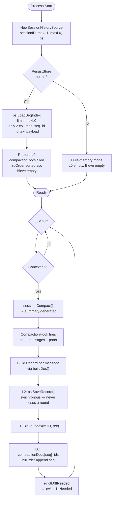
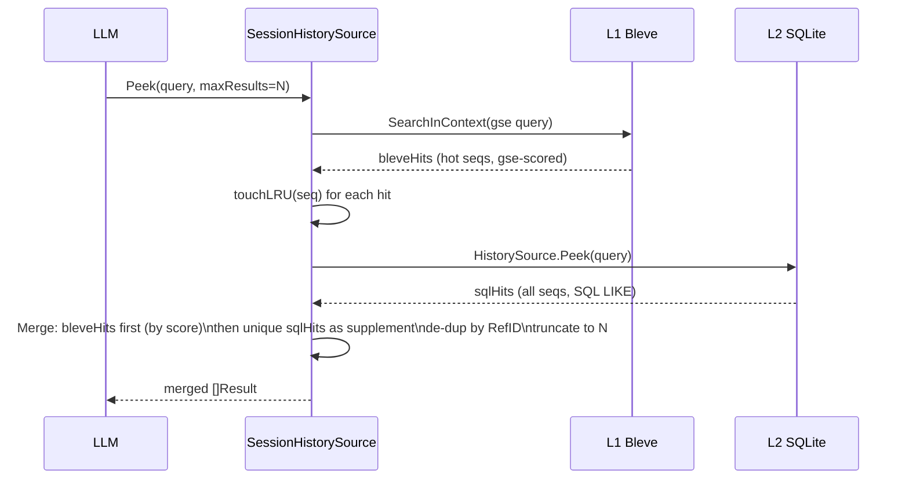
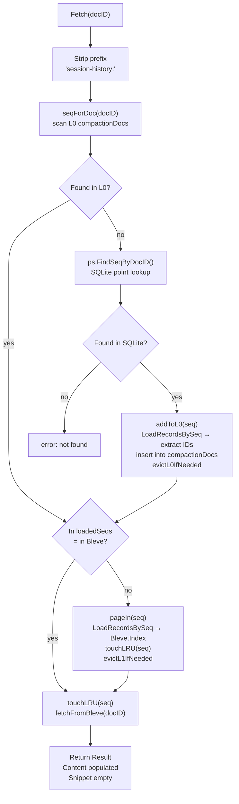
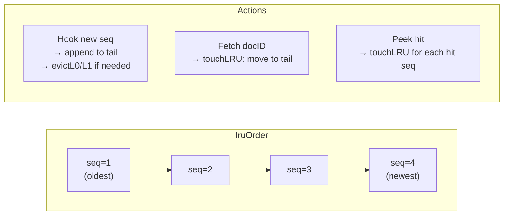
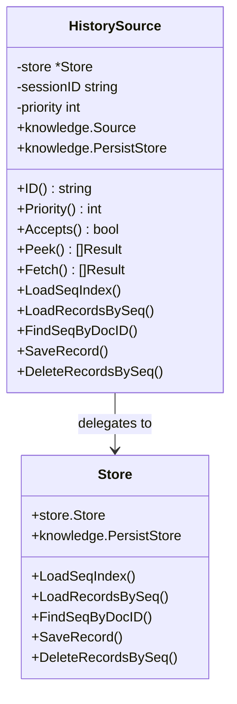

# Session Memory Architecture

`SessionHistorySource` gives the LLM access to compacted conversation history
that has scrolled out of the active context window. It is backed by a
**three-layer cache** that balances search speed, memory usage, and durability.

---

## Why Memory Exists

After `session.Compact()`, all messages before the compaction boundary are
hidden from the LLM. The LLM only sees the compaction summary plus the most
recent N turns. `SessionHistorySource` makes those hidden turns searchable
on demand via the standard `knowledge_search` / `knowledge_fetch` tools.

---

## Three-Layer Architecture

```
┌─────────────────────────────────────────────────────────────────┐
│  L0  compactionDocs  map[int][]string                           │
│      seq → []docID metadata index                               │
│      Cap: maxIndexedSeqs (default 80 = maxCompactions × 10)     │
│      Eviction: LRU — oldest seq removed from memory only        │
│                SQLite copy is NEVER touched by eviction          │
├─────────────────────────────────────────────────────────────────┤
│  L1  Bleve in-memory full-text index                            │
│      Cap: maxCompactions (default 8 seqs ≈ 50 MB)              │
│      Eviction: LRU — oldest seq deleted from Bleve              │
│      Tokenizer: gse (Chinese) + lowercase (ASCII)               │
├─────────────────────────────────────────────────────────────────┤
│  L2  SQLite history_docs table  (PersistStore)                  │
│      Cap: disk — unlimited, permanent                           │
│      Eviction: ONLY on explicit session Reset()                 │
│      Columns: id, session_id, role, text, tool_calls,           │
│               turn_index, compaction_seq, created_at            │
└─────────────────────────────────────────────────────────────────┘
```

### Invariant

```
loadedSeqs (L1) ⊆ compactionDocs (L0) ⊆ SQLite (L2)
```

Any seq in Bleve is also in L0; any seq in L0 is also in SQLite.
This is enforced by `evictL0IfNeeded()` which removes a seq from
Bleve **before** removing it from compactionDocs.

---

## Key Types

```go
// Record is the unit stored at every layer.
type Record struct {
    ID            string   // store.Message.ID — used as Bleve doc ID
    Role          string   // "user" | "assistant"
    Text          string   // all text parts concatenated
    ToolCalls     []string // tool names invoked in this turn
    TurnIndex     int      // position in compaction head (0-based)
    CompactionSeq int      // which compaction round (monotonically increasing)
    CreatedAt     int64    // unix ms
}

// PersistStore is the L2 persistence interface.
// sqlite.Store implements it; sqlite.HistorySource also implements Source
// so it can be registered with Manager for SQL-backed search.
type PersistStore interface {
    LoadSeqIndex(ctx, sessionID string, limit int) (map[int][]string, error)
    LoadRecordsBySeq(ctx, sessionID string, seq int) ([]Record, error)
    FindSeqByDocID(ctx, sessionID string, docID string) (int, bool, error)
    SaveRecord(ctx, sessionID string, rec Record) error
    DeleteRecordsBySeq(ctx, sessionID string, seq int) error
}
```

---

## Lifecycle: Startup → Compact → Search → Fetch



---

## Peek Strategy: P3 (Dual-Path, Always Both Layers)

`Peek` always queries **both** L1 and L2 to guarantee complete history
coverage regardless of what is currently hot in Bleve.



**Why always query both?**
- L1 has gse-segmented full-text scoring — best relevance for hot seqs.
- L2 covers all historical seqs regardless of LRU state — no memory loss.
- SQL LIKE is fast on local SQLite; P3 does not add significant latency.

---

## Fetch Strategy: Page-In On Demand

`Fetch` returns the **full text** of a specific document (identified by
`ref_id`). It locates the owning seq, page-ins from L2 to L1 if needed,
then returns the Bleve-stored content (with gse highlight support).



---

## LRU Eviction: L0 and L1 Share One lruOrder

Both L0 and L1 use the same `lruOrder []int` slice (head = LRU, tail = MRU).



### evictL0IfNeeded

```
while len(compactionDocs) > maxIndexedSeqs:
    oldest = lruOrder[0]  (first seq present in compactionDocs)
    if oldest ∈ loadedSeqs:          ← must maintain L1 ⊆ L0
        Bleve.Delete(all ids)
        delete loadedSeqs[oldest]
    delete compactionDocs[oldest]
    removeLRU(oldest)                ← remove from lruOrder
    // SQLite untouched
```

### evictL1IfNeeded

```
while len(loadedSeqs) > maxCompactions:
    oldest = lruOrder[0]  (first seq present in loadedSeqs)
    Bleve.Delete(all ids)
    delete loadedSeqs[oldest]
    // lruOrder entry stays — seq is still in L0
    // SQLite untouched
```

### Key Constraint

```
maxIndexedSeqs MUST be ≥ maxCompactions
```

`NewSessionHistorySource` enforces this: if `maxIndexedSeqs < maxCompactions`,
`maxIndexedSeqs` is silently raised to `maxCompactions`.

---

## Constructor

```go
// ps = nil → pure-memory mode (history lost on restart)
// ps = sqlite.NewHistorySource(st, sessID, 0) → L2 persistent
func NewSessionHistorySource(
    sessionID      string,
    maxCompactions int,    // L1 cap; 0 → DefaultMaxCompactions (8)
    maxIndexedSeqs int,    // L0 cap; 0 → DefaultMaxIndexedSeqs (80)
    ps             PersistStore,
) (*SessionHistorySource, error)
```

**Defaults:**

| Constant | Value | Meaning |
|----------|-------|---------|
| `DefaultMaxCompactions` | 8 | L1 Bleve holds ≤ 8 seqs ≈ 50 MB |
| `DefaultMaxIndexedSeqs` | 80 | L0 holds ≤ 80 seq→docID entries |

---

## Wiring in cmd/control and cmd/llm-api

Both commands support `-store sqlite:<path>` to enable L2 persistence.
The `HistorySource` object serves as both `PersistStore` (for the cache)
and `knowledge.Source` (registered with Manager for direct SQL search).

```go
// Build store (memory or sqlite)
sessionStore, _ = sqlitestore.Open(path)    // or memory.New()

// Inject PersistStore via interface assertion — no concrete type leak
var ps knowledge.PersistStore
if p, ok := sessionStore.(knowledge.PersistStore); ok {
    ps = p   // sqlite.Store implements PersistStore
}

// Create SessionHistorySource with L2 backend
historySrc, _ = knowledge.NewSessionHistorySource(
    sessionID,
    knowledge.DefaultMaxCompactions,
    knowledge.DefaultMaxIndexedSeqs,
    ps,
)

// Wire compaction hook
compactionHook = historySrc.Hook()

// Register with Manager
km.Register(historySrc)  // SessionHistorySource as Source (priority 0)
// Optional: also register HistorySource directly for SQL-backed search
// (if ps also implements Source, which sqlite.HistorySource does)
```

---

## sqlite.Store and sqlite.HistorySource

```
sqlite.Store
  implements store.Store          (sessions/messages/parts CRUD)
  implements knowledge.PersistStore  (LoadSeqIndex, LoadRecordsBySeq,
                                       FindSeqByDocID, SaveRecord,
                                       DeleteRecordsBySeq)

sqlite.HistorySource  (scoped to one sessionID)
  implements knowledge.Source     (ID, Priority, Accepts, Peek, Fetch)
  implements knowledge.PersistStore  (delegates to sqlite.Store)
  → single object passed to both Manager.Register() and NewSessionHistorySource()
```



---

## SQLite Schema (history_docs table)

```sql
CREATE TABLE IF NOT EXISTS history_docs (
    id             TEXT    NOT NULL,
    session_id     TEXT    NOT NULL,
    role           TEXT    NOT NULL DEFAULT '',
    text           TEXT    NOT NULL DEFAULT '',
    tool_calls     TEXT    NOT NULL DEFAULT '[]',   -- JSON array of strings
    turn_index     INTEGER NOT NULL DEFAULT 0,
    compaction_seq INTEGER NOT NULL DEFAULT 0,
    created_at     INTEGER NOT NULL DEFAULT 0,      -- unix ms
    PRIMARY KEY (session_id, compaction_seq, id)
);
CREATE INDEX IF NOT EXISTS idx_history_session
    ON history_docs(session_id, compaction_seq);
```

### Key SQL queries

```sql
-- LoadSeqIndex: startup — only 2 columns, no text payload
SELECT compaction_seq, id
FROM history_docs
WHERE session_id = ?
  AND compaction_seq IN (
      SELECT DISTINCT compaction_seq
      FROM history_docs
      WHERE session_id = ?
      ORDER BY compaction_seq DESC
      LIMIT ?          -- maxIndexedSeqs
  )
ORDER BY compaction_seq DESC, turn_index ASC;

-- LoadRecordsBySeq: page-in one seq
SELECT id, role, text, tool_calls, turn_index, compaction_seq, created_at
FROM history_docs
WHERE session_id = ? AND compaction_seq = ?
ORDER BY turn_index ASC;

-- FindSeqByDocID: L0 miss resolution
SELECT compaction_seq
FROM history_docs
WHERE session_id = ? AND id = ?;

-- HistorySource.Peek: SQL LIKE search (L2 path in P3)
SELECT id, role, text, turn_index, compaction_seq
FROM history_docs
WHERE session_id = ? AND text LIKE ? ESCAPE '\'
ORDER BY compaction_seq DESC, turn_index ASC
LIMIT ?;
```

---

## Reset Semantics

`Reset()` = "wipe memory for this session":

```
Reset()
  1. DeleteRecordsBySeq() for every seq in compactionDocs  ← SQLite DELETE
  2. Bleve.Close() + bleve.NewMemOnly()                    ← L1 rebuilt empty
  3. compactionDocs = {}                                   ← L0 cleared
  4. loadedSeqs = {} / lruOrder = nil / currentSeq = 0
```

After Reset, the source is fully functional — new Hook calls will re-populate
all three layers from scratch.

---

## Testing

Tests live in `knowledge/session_history_test.go` with 19 cases across 3 levels:

| Level | Focus |
|-------|-------|
| 1 (pure-memory) | Hook+Peek, Fetch, L1 eviction, evicted-unreachable, Reset |
| 2 (memPersist stub) | L2 persistence, P3 merge, dedup, page-in L0/L0-miss, L0 eviction, LRU touch, Reset clears L2 |
| 3 (invariants) | L1⊆L0 holds across 6 rounds, concurrent no-race, multi-message, empty-query, Bleve-before-L2 ordering |

**Important:** all test text uses Chinese words tokenizable by gse (机器学习,
区块链, 云计算, etc.) — ASCII words and most single Chinese characters are
split into individual characters by gse and cannot be used as search terms.

**Golden words verified to work with gse:**
`协程`, `系统设计`, `接口设计`, `微服务`, `机器学习`, `深度学习`, `区块链`, `云计算`

---

## Common Mistakes

| Mistake | Effect | Fix |
|---------|--------|-----|
| `maxIndexedSeqs < maxCompactions` | `maxIndexedSeqs` silently raised | Always pass `maxIndexedSeqs ≥ maxCompactions` |
| Passing `*sqlite.Store` directly as `PersistStore` | Works for persistence but no SQL Peek fallback in P3 | Pass `sqlite.NewHistorySource(st, sessID, 0)` instead |
| Calling `historySrc.Hook()` more than once | Second call returns a new closure with same shared state — safe | Cache `hook = historySrc.Hook()` once at session start |
| Expecting evicted (L1/L0) docs to be searchable without L2 | Pure-memory mode: evicted docs are gone forever | Pass a `PersistStore` for durable recall |
| Using ASCII-only search terms in tests | gse splits ASCII into chars → 0 hits | Use Chinese compound words from the golden list |

---

## Key Files

| File | Purpose |
|------|---------|
| `knowledge/session_history.go` | `SessionHistorySource` — L0/L1 cache, P3 Peek, page-in Fetch, LRU |
| `knowledge/persist.go` | `PersistStore` interface + `Record` type |
| `knowledge/session_history_test.go` | 19 layered tests (pure-memory → stub → invariants) |
| `store/sqlite/sqlite.go` | `Store` (store.Store + PersistStore) and `HistorySource` (Source + PersistStore) |
| `store/sqlite/migrations/001_init.sql` | `history_docs` table schema |
| `store/sqlite/sqlite_test.go` | SQLite PersistStore tests + HistorySource Peek/Fetch tests |
| `cmd/control/main.go` | `-store` flag wiring; `sessionStore.(knowledge.PersistStore)` injection |
| `cmd/llm-api/main.go` | Same pattern as control |
