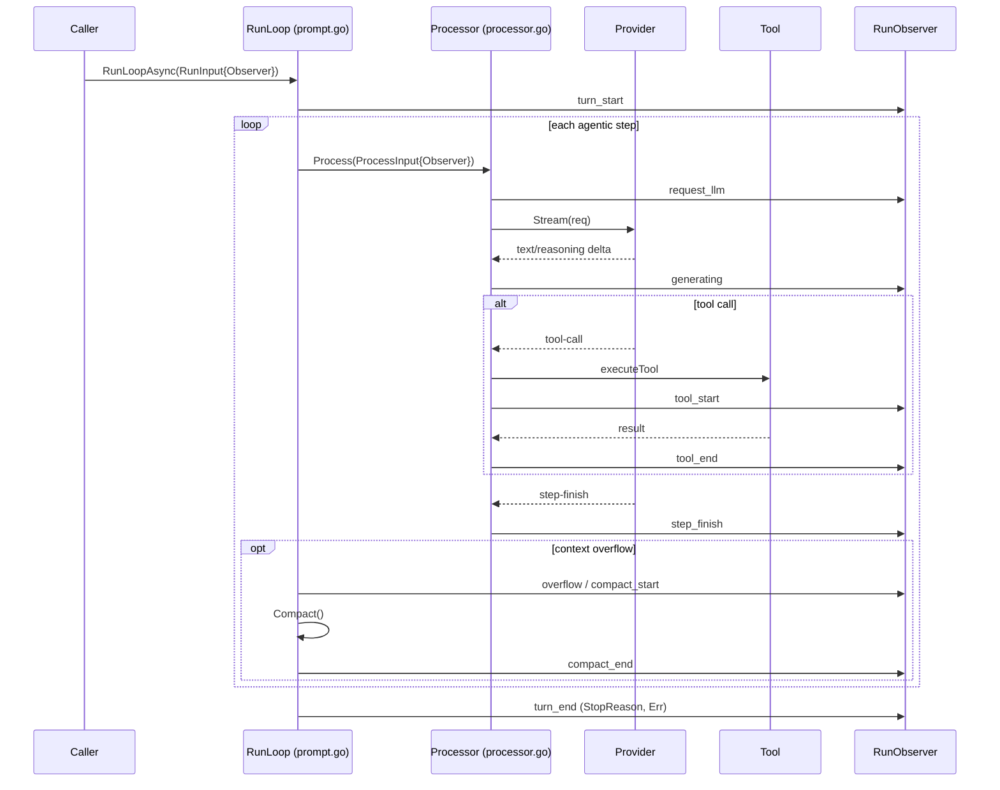
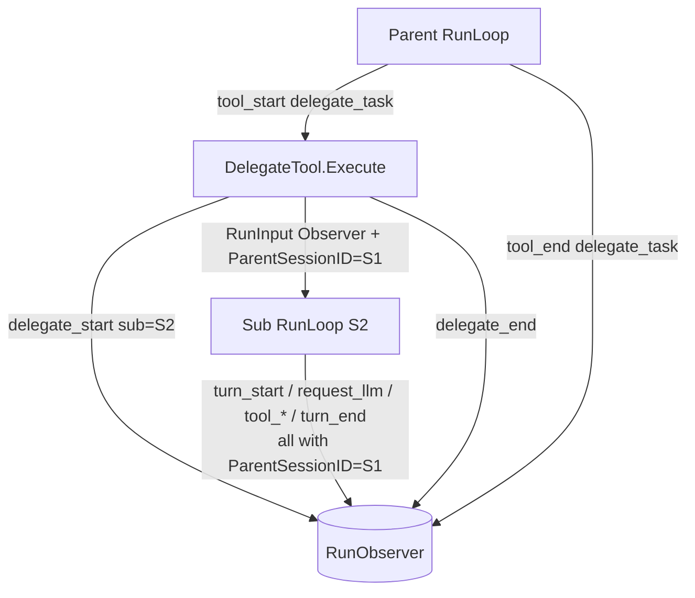
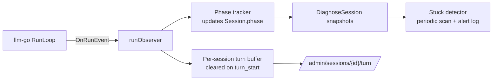

# Skill: RunObserver

`RunObserver` is `llm-go`'s **runtime observability hook**. It lets a caller
subscribe to the key state transitions of a `RunLoop` (and any `delegate_task`
sub-sessions it spawns) without touching control flow.

Primary use cases:

- **Live monitoring** — show what a session is doing right now (waiting on the
  LLM, generating text, running a specific tool, compacting context).
- **Stuck-session diagnosis** — detect a session stalled in `request_llm` or
  `tool_start` for too long.
- **Metrics / tracing** — count tool calls, measure step latency, record
  overflow/compaction frequency.

Module path: `github.com/larryhou/llm-go/session`
Source: `session/observer.go` (interface + event schema), with emit calls in
`session/processor.go`, `session/prompt.go`, `session/delegate.go`.

---

## 1. Design contract

`RunObserver` is deliberately minimal and side-effect-free:

| Property | Rule |
|---|---|
| **Broadcast-only** | Events are pure notifications. `llm-go` never stores them. |
| **Optional, zero-cost** | `RunInput.Observer == nil` is a no-op; every emit point checks nil first via `emitRun`. |
| **Backward compatible** | Existing callers that don't set `Observer` are unaffected. |
| **Must not block** | `OnRunEvent` is called **synchronously on the RunLoop goroutine**. Implementations must return quickly — only update in-memory state or enqueue. Blocking here stalls the LLM loop. |
| **Concurrency-safe** | A single Observer may receive events from a parent turn and its delegate sub-sessions concurrently. The implementation must lock. |

The whole interface:

```go
type RunObserver interface {
    OnRunEvent(RunEvent)
}
```

The internal helper guarantees nil-safety and timestamp filling — all emit
points go through it:

```go
func emitRun(obs RunObserver, ev RunEvent) {
    if obs == nil {
        return
    }
    if ev.At.IsZero() {
        ev.At = time.Now()
    }
    obs.OnRunEvent(ev)
}
```

---

## 2. RunEvent schema

```go
type RunEvent struct {
    SessionID       string       // session this event belongs to
    ParentSessionID string       // non-empty ⇒ this is a delegate sub-session event
    Kind            RunEventKind // discriminator (see §3)
    Tool            string       // tool name (tool_start/tool_end/doom_loop/delegate_*)
    ToolError       string       // error message when a tool fails (tool_end)
    StopReason      StopReason   // turn_end only: ""|max_steps|timeout
    Err             error        // turn_end / compact_end: failure cause
    Detail          string       // free-text context: overflow reason, omitted count, …
    At              time.Time    // event time (auto-filled if zero)
}
```

Field usage is **by Kind** — read only the fields documented for each kind in §3.

---

## 3. Event kinds and where they fire

```
RunKindTurnStart      turn_start      prompt.go runLoopInternal — after the user message is persisted
RunKindRequestLLM     request_llm     processor.go Process — just before provider.Stream() (once per agentic step)
RunKindGenerating     generating      processor.go handleEvent — first text/reasoning delta of a step
RunKindToolStart      tool_start      processor.go executeTool — before tool.Execute()
RunKindToolEnd        tool_end        processor.go executeTool — defer, any exit path (ToolError set on failure)
RunKindStepFinish     step_finish     processor.go handleEvent — EventStepFinish
RunKindTurnEnd        turn_end        prompt.go RunLoopAsync goroutine — after runLoopInternal returns (StopReason/Err set)
RunKindCompactStart   compact_start   prompt.go — before compactor.Compact() (predictive & reactive paths)
RunKindCompactEnd     compact_end     prompt.go — after Compact() (Err set on failure)
RunKindToolsOmitted   tools_omitted   prompt.go — OmitConsumedTools pruning (Detail = count)
RunKindOverflow       overflow        prompt.go — context-overflow fallback (replace oversized tool output / reactive compact)
RunKindDoomLoop       doom_loop       processor.go handleEvent — same tool+args repeated DoomLoopThreshold times
RunKindDelegateStart  delegate_start  delegate.go Execute — sub-session created (SessionID = sub, ParentSessionID = parent)
RunKindDelegateEnd    delegate_end    delegate.go Execute — defer, sub-session finished
```

> Note: the post-turn `Prune` step and the internal summary LLM calls
> (`delegate_summary.go`, `compaction.go`) intentionally do **not** emit
> `request_llm` / `generating` — those `Process` calls run with
> `ProcessInput.Observer == nil` so internal sub-operations never pollute the
> user-visible phase stream.

### Phase interpretation

The kinds map naturally to a coarse "what is the session doing now" phase:

| Phase | Entered by | Stuck signal |
|---|---|---|
| waiting for LLM | `turn_start`, `request_llm`, `tool_end`, `step_finish` | long dwell ⇒ provider request hung |
| generating | `generating` | long dwell ⇒ stream stalled mid-response |
| running tool | `tool_start` (until matching `tool_end`) | long dwell ⇒ tool hung |
| idle | `turn_end` | — |

`tool_end` maps back to "waiting for LLM" because the tool result is about to be
fed back to the model for the next step.

---

## 4. Event flow (single turn)



---

## 5. Delegate sub-session propagation

When the LLM calls `delegate_task`, `DelegateTool.Execute` spins up a fresh
sub-session via `RunLoopAsync`, forwarding the **same Observer** and setting
`ParentSessionID`. Every event from the sub-session therefore carries the
parent's ID, so a downstream consumer can group sub-session activity under the
parent turn.



Grouping rule for a consumer:

```
topLevelID := ev.SessionID
if ev.ParentSessionID != "" {
    topLevelID = ev.ParentSessionID   // attribute to the parent turn
}
```

---

## 6. Wiring

### Top-level turn

```go
h := session.RunLoopAsync(ctx, store, session.RunInput{
    SessionID: sessID,
    UserMsg:   userMsg,
    Model:     model,
    Provider:  provider,
    Tools:     tools,
    Observer:  myObserver, // ← runtime events
})
```

### Delegate sub-sessions

Pass the same observer through `DelegateConfig` so sub-sessions report too:

```go
delegate := session.NewDelegateTool(
    parentSessionID, store, tools,
    func(sub string) llm.Provider { return provider },
    provider, model, cfg,
    session.DelegateConfig{
        MaxSteps: 40,
        Timeout:  5 * time.Minute,
        Observer: myObserver, // ← forwarded to sub-session RunLoop
    },
)
```

### Minimal observer

```go
type logObserver struct{}

func (logObserver) OnRunEvent(ev session.RunEvent) {
    // MUST be fast & non-blocking.
    log.Printf("[run] sess=%s parent=%s kind=%s tool=%s detail=%s",
        ev.SessionID, ev.ParentSessionID, ev.Kind, ev.Tool, ev.Detail)
}
```

### Real-world consumer (j3engine mcpagent)

`service/mcpagent` implements a single shared observer that fans out to three
in-memory consumers — a useful reference pattern:



- **Phase tracker** — maps each event to a `phase` field for a live status view.
- **Turn buffer** — keeps the full ordered event stream of the *current* turn
  per top-level session (sub-session events folded in via `ParentSessionID`),
  cleared on `turn_start`. Broadcast-only: nothing is persisted; dropped on
  session eviction.
- **Stuck detector** — periodically scans phases and logs an alert when a
  session dwells in `waiting_llm` / `tool_running` past a threshold.

That codebase also feeds **its own non-llm-go events** (mode enter/exit, store
mount) into the same per-turn buffer by constructing a `RunEvent` with a
custom string `Kind` — since `RunEventKind` is a string type, downstream
buffers can carry app-specific kinds on one unified timeline.

---

## 7. Pitfalls

- **Do not block in `OnRunEvent`.** It runs on the RunLoop goroutine. Offload
  any I/O (DB writes, network, notifications) to a queue/goroutine.
- **Events are not persisted.** If you need history, the consumer must buffer
  it. `llm-go` deliberately keeps the hook stateless.
- **`request_llm` fires once per agentic step**, not once per turn — a turn with
  three tool round-trips emits it four times.
- **Generating may not fire** for a step that goes straight to a tool call with
  no text/reasoning. Don't assume every step has a `generating`.
- **Sub-session events share the parent's Observer**, so a single Observer must
  be safe to call from multiple goroutines concurrently.
- **Internal summary/compaction Process calls carry no Observer** — that is
  intentional. Don't "fix" it by threading the Observer in, or you'll surface
  internal LLM calls as user-visible phases.
