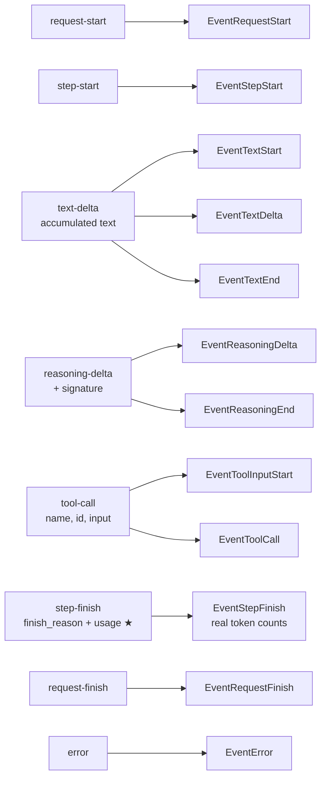
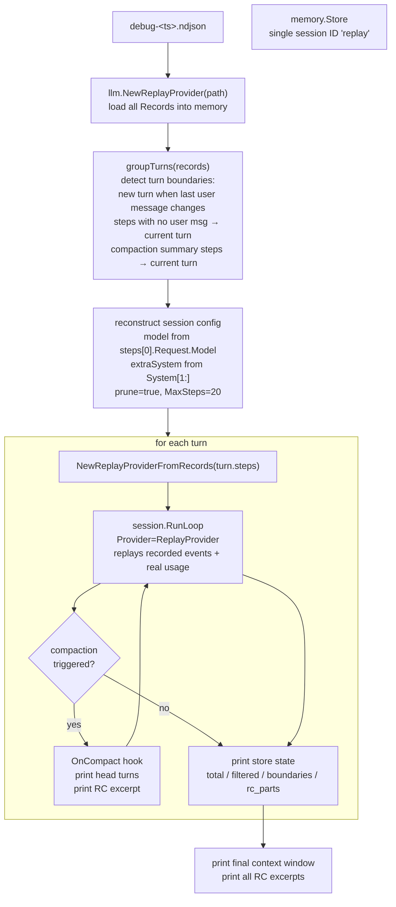

# Skill: replay

Provides deterministic session replay for `llm-go`. A real session is recorded
once with `RecordProvider`; subsequent replays use `ReplayProvider` to drive
`session.RunLoop` with identical token counts, tool calls, and text — no LLM
required. Primary use: diagnosing compaction bugs by reproducing exact `Select()`
decisions from production recordings.

---

## Architecture

```mermaid
flowchart TD
    subgraph Record["Record phase (real session)"]
        RP["real_provider\n(Anthropic/OpenAI)"]
        REC["RecordProvider\nllm/record_provider.go"]
        HOOK["hookProvider / sseProvider\n(REPL tee / SSE forwarder)"]
        RL1["session.RunLoop"]
        NDJSON["debug-&lt;ts&gt;.ndjson\none JSON line per Stream() call"]

        RP --> REC
        REC --> HOOK
        HOOK --> RL1
        REC -->|"append Record after stream closes"| NDJSON
    end

    subgraph Replay["Replay phase (no LLM)"]
        NDJSON2["debug-&lt;ts&gt;.ndjson"]
        LOAD["llm.NewReplayProvider\nload all Records"]
        GROUP["groupTurns()\ndetect turn boundaries\nby last user message"]
        TURN["per-turn ReplayProvider\nNewReplayProviderFromRecords"]
        RL2["session.RunLoop\nsame model + config\nreal token usage replayed"]
        OUT["compaction diagnosis\nboundaries / RC parts / Select() decisions"]

        NDJSON2 --> LOAD
        LOAD --> GROUP
        GROUP --> TURN
        TURN --> RL2
        RL2 --> OUT
    end
```



### Key design principles

- **Zero invasion**: `RecordProvider` is a pure `llm.Provider` wrapper. No lifecycle
  methods (`StartTurn`/`FinishTurn`) are needed. The session framework, compaction,
  and tool execution are completely unaware of recording.
- **Data-driven replay**: `ReplayProvider` ignores the `Request` argument passed to
  `Stream()` and replays the recorded events. Turn grouping is done externally in
  `cmd/replay` by inspecting `Record.Request.Messages`.
- **Real token usage**: `EventStepFinish.Usage` is stored verbatim. Replaying with
  real token counts means `estimateTurnTokens` in `Select()` fires compaction at
  exactly the same turn boundary as the original session.

---

## File Format

**`debug-<unix_ms>.ndjson`** — one JSON object per line, each line is one `Record`:

```jsonl
{"request":{"Model":{...},"Messages":[...],"Tools":[...],...},"events":[{"type":"request-start"},{"type":"step-start"},{"type":"text-delta","text":"Hello"},{"type":"tool-call","tool_name":"read","tool_call_id":"id1","input":{...}},{"type":"step-finish","finish_reason":"tool-calls","usage":{"input":12450,"output":87}},{"type":"request-finish","finish_reason":"tool-calls"}]}
{"request":{...},"events":[...]}
```

One file = one session. One line = one `Stream()` call (one agentic step).

### Stored event types

Only semantically significant events are stored. Low-level events
(`EventTextStart/End`, `EventToolInputStart/Delta`) are synthesised on replay.

| Event stored | Why |
|---|---|
| `EventRequestStart` | lifecycle marker |
| `EventStepStart` | step boundary |
| `EventTextDelta` | accumulated full text (not per-chunk) |
| `EventReasoningDelta` + `EventReasoningEnd` | reasoning blocks with signature |
| `EventToolCall` | name, id, parsed input for tool dispatch |
| `EventStepFinish` | **finish_reason + real usage** ← critical for compaction |
| `EventRequestFinish` | end marker |
| `EventError` | LLM errors |

---

## Types (`llm/record_provider.go`, `llm/replay_provider.go`)

```go
// RecordEvent — JSON snapshot of one event
type RecordEvent struct {
    Type         EventType    `json:"type"`
    Text         string       `json:"text,omitempty"`
    Signature    string       `json:"signature,omitempty"`
    ToolCallID   string       `json:"tool_call_id,omitempty"`
    ToolName     string       `json:"tool_name,omitempty"`
    Input        any          `json:"input,omitempty"`
    FinishReason FinishReason `json:"finish_reason,omitempty"`
    Usage        *TokenUsage  `json:"usage,omitempty"`  // EventStepFinish only
    Error        string       `json:"error,omitempty"`
}

// Record — one line in the ndjson file
type Record struct {
    Request Request       `json:"request"`
    Events  []RecordEvent `json:"events"`
}
```

---

## RecordProvider (`llm/record_provider.go`)

Wraps any `llm.Provider`. Each `Stream()` call proxies to `inner`, tees all
events to the caller, and appends one `Record` to the ndjson file after the
stream closes. Thread-safe: concurrent `Stream()` calls (parallel tool execution)
are serialised only at the final `json.Encoder.Encode` step.

```mermaid
sequenceDiagram
    participant Caller as session.Processor
    participant RP as RecordProvider
    participant Inner as inner Provider
    participant File as ndjson file

    Caller->>RP: Stream(ctx, req)
    RP->>Inner: Stream(ctx, req)
    Inner-->>RP: inner channel

    loop for each event
        Inner-->>RP: ev
        RP-->>Caller: out ← ev  (transparent pass-through)
        RP->>RP: recordEvent(&step, ev)\naccumulate text deltas\nstore usage verbatim
    end

    Note over Inner,RP: inner channel closed
    RP->>File: mu.Lock(); enc.Encode(step)\none JSON line appended
    RP-->>Caller: out channel closed
```

```go
rec, err := llm.NewRecordProvider(innerProv, "debug-1234.ndjson")
if err != nil { ... }
defer rec.Close()
// Use rec anywhere llm.Provider is accepted — RunLoop, compaction, etc.
```

### Wiring in `cmd/control` (`cmd/control/main.go`)

```go
if cfg.debug {
    path := fmt.Sprintf("debug-%d.ndjson", time.Now().UnixMilli())
    rec, err := llm.NewRecordProvider(innerProv, path)
    if err != nil { ... }
    defer rec.Close()
    innerProv = rec          // ← transparent override, nothing else changes
    fmt.Printf("Debug recording: %s\n", path)
}
```

`innerProv` is then wrapped by `hookProvider` (REPL event tee) or `sseProvider`
(web SSE forwarder) — neither is aware of the recording layer beneath.

---

## ReplayProvider (`llm/replay_provider.go`)

Reads the ndjson file and replays one `Record` per `Stream()` call. Synthesises
low-level lifecycle events from the stored higher-level ones.

```go
// From file:
prov, err := llm.NewReplayProvider("debug-1234.ndjson")

// From in-memory slice (used by cmd/replay per-turn):
prov := llm.NewReplayProviderFromRecords(records)

prov.ID()       // "replay"
prov.Len()      // total number of records
prov.Records()  // []Record slice
```

### Event expansion (`expand` function)



★ `EventStepFinish.Usage` carries the real token counts from the original LLM
response — this is what makes `estimateTurnTokens` fire compaction at the
correct turn boundary during replay.

---

## cmd/replay

Full data-driven replay of a recorded session. No real LLM calls.

```bash
go run ./cmd/replay -recording debug-<ts>.ndjson
go run ./cmd/replay -recording debug-<ts>.ndjson -verbose
```



### Turn grouping logic

A new turn begins when the last user message in `Request.Messages` changes from
the previous step. Two special cases are merged into the **current** turn rather
than starting a new one:

1. **No user message** — step has no user message at all (rare).
2. **Compaction summary step** — the last user message starts with
   `session.SummaryTemplate` prefix. This step is the internal LLM call that
   `session.Compact()` issues to generate the history summary. It must be fed to
   the same per-turn `ReplayProvider` as the step that triggered compaction,
   otherwise the provider runs out of steps before `Compact()` can finish.

```go
func groupTurns(steps []llm.Record) []turnGroup {
    // A new turn begins when last user message changes AND is not a summary step.
    // Steps with no user msg or compaction summary prompt → current turn.
}

func isSummaryStep(key string) bool {
    return strings.HasPrefix(key, session.SummaryTemplate[:60])
}
```

### Config alignment with `cmd/control`

`cmd/replay` reconstructs session config from the first record's `Request`:

| Config | Source |
|---|---|
| `model` | `steps[0].Request.Model` |
| `extraSystem` | `steps[0].Request.System[1:]` (System[0] is provider prompt) |
| `sessionCfg.Compaction.Prune` | `true` (matches cmd/control default) |
| `MaxSteps` | `20` (matches cmd/control web mode) |

### Example output

```
[recording] debug-1778934906.ndjson  total_steps=27

[turns] detected 6 turns
  turn 1: "你对llm-go了解么"  (4 steps)
  turn 2: "详细分析下llm"  (3 steps)
  ...
  turn 6: "所以必须用户主动说终止才会停止是么"  (7 steps)

┌─ Turn 6: "所以必须用户主动说终止才会停止是么"

╔══ COMPACTION #1 ════════════════════════════════════
║  head: 38 messages
║  real user turns in head: 5
║    user: 你对llm-go了解么
║    user: 详细分析下llm
║    user: 能看下错误处理么
║    user: 听说已经支持中断处理了
║    user: 那么如果前一个会话还在tool call...
╚════════════════════════════════════════════════════

│  store: total=42 filtered=6 boundaries=1 rc_parts=1
└─ turn 6 done  (consumed 7/7 steps)
```

---

## Using replay to diagnose and verify bugs

The ndjson recording + `ReplayProvider` form a complete offline debugging loop:
no real LLM calls are needed to find root causes or confirm fixes.

### Pattern 1 — Inspect a suspicious step directly from ndjson

```python
import json

with open("debug-<ts>.ndjson") as f:
    lines = [l for l in f.readlines() if l.strip()]

# Find any step whose events look wrong (e.g. no text-delta, usage=0)
for i, line in enumerate(lines):
    rec = json.loads(line)
    events = rec["events"]
    etypes = [e["type"] for e in events]
    for e in events:
        if e["type"] == "step-finish":
            usage = e.get("usage", {})
            if usage.get("output", -1) == 0:
                print(f"step {i+1}: suspicious — output=0, events={etypes}")
                # Inspect last message in request
                msgs = rec["request"]["Messages"]
                last = msgs[-1]
                print(f"  last msg: role={last['role']}")
                for cp in last.get("content", []):
                    print(f"    type={cp['type']} text={cp.get('text','')[:80]!r}")
```

**Real example — MaxSteps prefill bug:**
Step 61 showed `events=['request-start','step-start','step-finish','request-finish']`
with `usage=0` and no `text-delta`. Inspecting the request revealed
`last msg role=assistant text='CRITICAL - MAXIMUM STEPS REACHED...'` —
Anthropic silently ignores assistant prefill and returns an empty response.

**Fix:** change prefill to a user message (`llm.NewUserMessage(PromptMaxSteps)`).

### Pattern 2 — Wrap ReplayProvider with a probe to observe request structure

```go
type probeProvider struct {
    inner *llm.ReplayProvider
    step  int
}

func (p *probeProvider) ID() string { return "probe" }
func (p *probeProvider) Stream(ctx context.Context, req llm.Request) (<-chan llm.Event, error) {
    p.step++
    last := req.Messages[len(req.Messages)-1]
    for _, cp := range last.Content {
        if cp.Type == "text" && cp.Text != "" {
            fmt.Printf("step %2d: last_msg role=%-10s text=%q\n",
                p.step, last.Role, cp.Text[:80])
            break
        }
    }
    return p.inner.Stream(ctx, req)
}
```

Feed the probe into `session.RunLoop` with the same `MaxSteps` and model as
the original session. After the fix, the output for the isLastStep should show
`role=user` instead of `role=assistant`.

### Workflow summary

```
1. Record a real session with cmd/control -debug
2. Spot anomaly in ndjson (empty events, usage=0, wrong finish_reason)
3. Inspect the request messages of that step directly in Python
4. Identify root cause (wrong message role, missing content, etc.)
5. Apply fix
6. Re-run via probeProvider or cmd/replay to confirm the request is now correct
   — all offline, no real LLM calls
```

---

## Key Code Locations

| Component | File | Key location |
|---|---|---|
| `RecordEvent` / `Record` types | `llm/record_provider.go` | lines 31–48 |
| `RecordProvider.Stream()` | `llm/record_provider.go` | `Stream()` + `recordEvent()` |
| `RecordProvider.Close()` | `llm/record_provider.go` | `Close()` |
| `ReplayProvider.Stream()` | `llm/replay_provider.go` | `Stream()` + `expand()` |
| `NewReplayProviderFromRecords` | `llm/replay_provider.go` | constructor |
| Wiring in cmd/control | `cmd/control/main.go` | `-debug` block |
| Turn grouping | `cmd/replay/main.go` | `groupTurns()` |
| Config reconstruction | `cmd/replay/main.go` | model/extraSystem/sessionCfg setup |

---

## Verifying RC excerpt injection from the ndjson

After compaction, the `PartTypeRecentContext` excerpt should appear in the
**first step after compaction** as an extra content part on the compaction
boundary user message. This can be verified directly from the ndjson without
running replay:

```python
import json

with open("debug-<ts>.ndjson") as f:
    lines = f.readlines()

# Find the first step whose input tokens dropped sharply (compaction happened)
# then inspect its Request.Messages for the RC excerpt.
for i, line in enumerate(lines):
    rec = json.loads(line)
    msgs = rec["request"]["Messages"]
    for m in msgs:
        if m.get("role") != "user":
            continue
        for cp in m.get("content", []):
            text = cp.get("text", "")
            if "以下是压缩前最近的对话原文" in text:
                print(f"step {i+1}: RC excerpt found in boundary user message")
                print(text[:400])
```

Expected output after a successful compaction:
```
step 29: RC excerpt found in boundary user message
---
以下是压缩前最近的对话原文：

**[用户]**
继续看下provider设计

**[助手]**
- 调用工具: read → ...

**[用户]**
把你发现的问题用规范的方式列出来...
```

The boundary user message has **two** content parts:
1. The original user text (e.g. `"What did we do so far?"`)
2. The RC excerpt starting with `---\n以下是压缩前最近的对话原文：`

If the excerpt is missing, either compaction did not fire or `buildRecentContextExcerpt`
produced an empty string (no user turns in `sel.RecentHead`).

---

## Known Limitations

- **Tool execution in replay**: `cmd/replay` does not register real tools. Tool
  calls from the recording are replayed as events to `session.Processor`, which
  will attempt to execute them. If the tools are not registered, the processor
  gets a "tool not found" error — which is stored as a tool error part but does
  not abort the loop. This means compaction still fires at the correct point even
  without real tools.

- **Compaction summary provider**: During replay, the compaction summary LLM call
  also goes through `ReplayProvider`. If the compaction step's `Record` is present
  in the recording (it is — `RecordProvider` captures all `Stream()` calls including
  summary calls), the summary is replayed correctly.

- **Non-deterministic tool outputs**: If a tool output in the original session was
  large enough to affect token counts, but the tool isn't registered in replay,
  the `ToolPartData.Output` will be empty. This can cause `estimateTurnTokens` to
  undercount slightly. The recorded `EventStepFinish.Usage` compensates: it carries
  the real token count from the original LLM response (which already saw the full
  tool output), so compaction budget arithmetic is still accurate.
